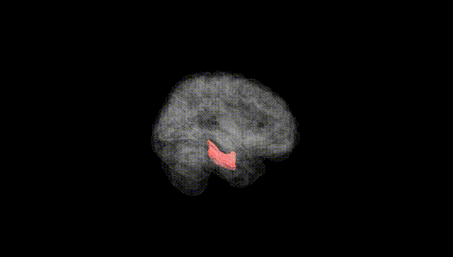
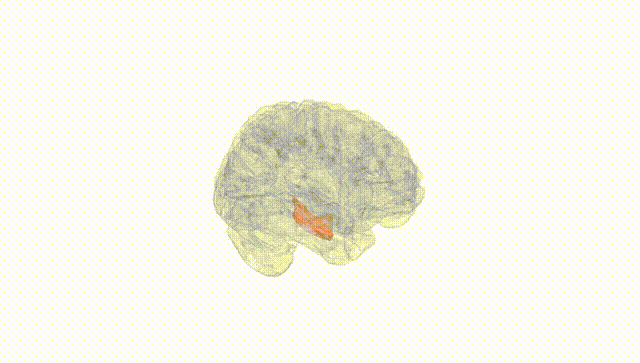
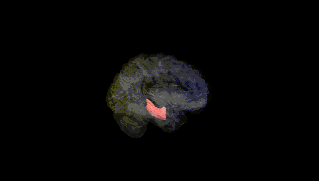
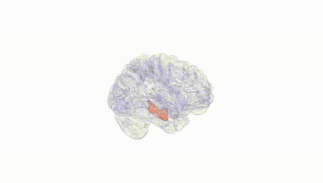
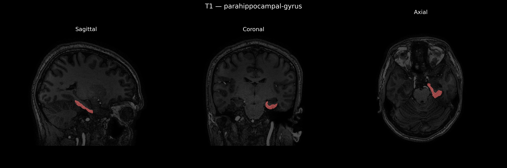
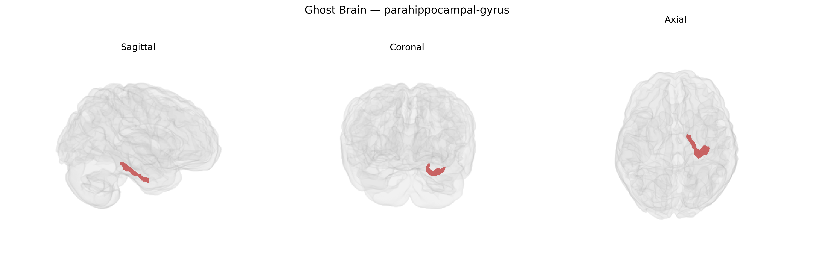

# parahippocampal-gyrus

## Overview

The left parahippocampal gyrus is a medial temporal lobe structure that lies along the ventromedial surface of the cerebral hemisphere, bordering the hippocampal formation and extending from the temporal pole posteriorly toward the splenium of the corpus callosum. It is composed of archicortical and periallocortical regions, including the entorhinal cortex anteriorly and parahippocampal cortex more posteriorly, and receives multimodal sensory input from widespread association cortices. Functionally, the left parahippocampal gyrus is strongly implicated in episodic and autobiographical memory, contextual and spatial scene processing, and encoding of environmental layout, with lateralization on the left often associated with verbal and narrative memory processes. It forms critical connections with the hippocampus, amygdala, prefrontal cortex, and posterior cingulate/retrosplenial regions, supporting its role in memory consolidation and navigation-related computations. There is no direct Wikipedia page for the “left parahippocampal gyrus” as a separate entry; a closely related and encompassing structure is the parahippocampal gyrus: https://en.wikipedia.org/wiki/Parahippocampal_gyrus.

*Overview generated by GPT-4o (2026).*

---

**Region ID:** 87  
**Hemisphere:** Left  
**Atlas:** brainCOLOR 

---

## Full Brain – Black Background

**Full Quality Version:** [Download MP4](full_black.mp4)

---

## Full Brain – White Background

**Full Quality Version:** [Download MP4](full_white.mp4)

---

## Hemisphere Only – Black Background

**Full Quality Version:** [Download MP4](hemi_black.mp4)

---

## Hemisphere Only – White Background

**Full Quality Version:** [Download MP4](hemi_white.mp4)

---

## Triplanar View – T1 Background

---

## Triplanar View – Ghost Brain


