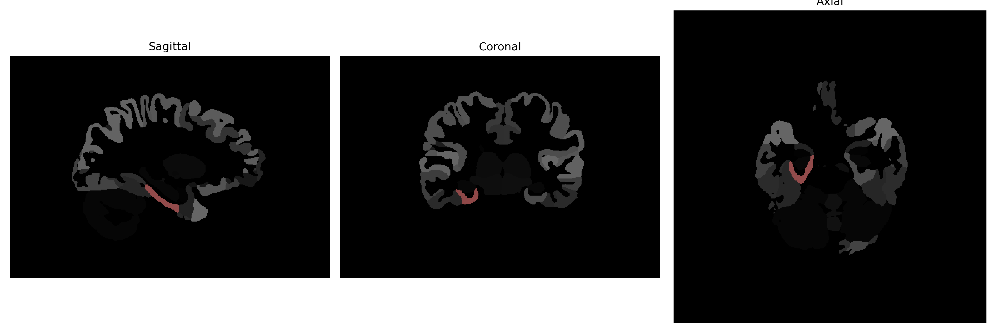

# parahippocampal-gyrus

## Overview

The right parahippocampal gyrus is a cortical region in the medial temporal lobe of the brain, located adjacent to the hippocampus. It plays a crucial role in memory encoding and retrieval, navigation, and scene recognition. The parahippocampal gyrus contains important structures such as the entorhinal cortex and the parahippocampal cortex, which are key in transmitting information to and from the hippocampus. It is also involved in spatial memory and contextual associations, allowing individuals to recall the context of experiences. Imaging studies have shown its involvement in recognizing scenes and in the processing of high-level visual aspects. 

There is no direct Wikipedia link to a description specifically of the "Right parahippocampal gyrus" from the brainCOLOR Atlas, but more general information can be found here: [Parahippocampal gyrus](https://en.wikipedia.org/wiki/Parahippocampal_gyrus).

*Overview generated by GPT-4o (2026).*

---

**Region ID:** 86  
**Hemisphere:** Right  
**Atlas:** brainCOLOR 

---

## Full Brain – Black Background

**Full Quality Version:** [Download MP4](full_black.mp4)

---

## Full Brain – White Background

**Full Quality Version:** [Download MP4](full_white.mp4)

---

## Hemisphere Only – Black Background

**Full Quality Version:** [Download MP4](hemi_black.mp4)

---

## Hemisphere Only – White Background

**Full Quality Version:** [Download MP4](hemi_white.mp4)

---

## Triplanar View (Centered on ROI)

