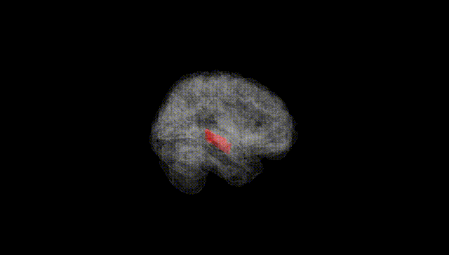
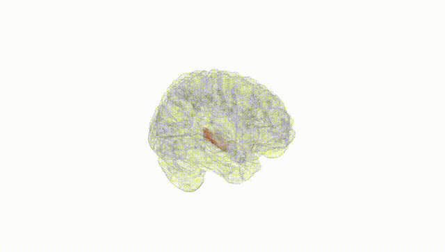
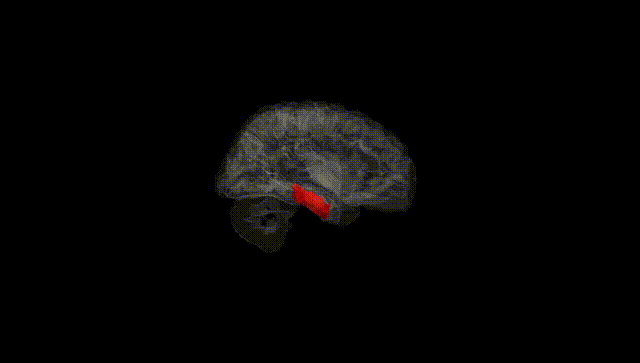
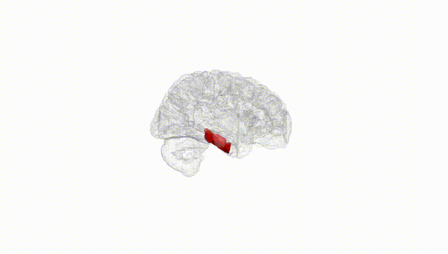
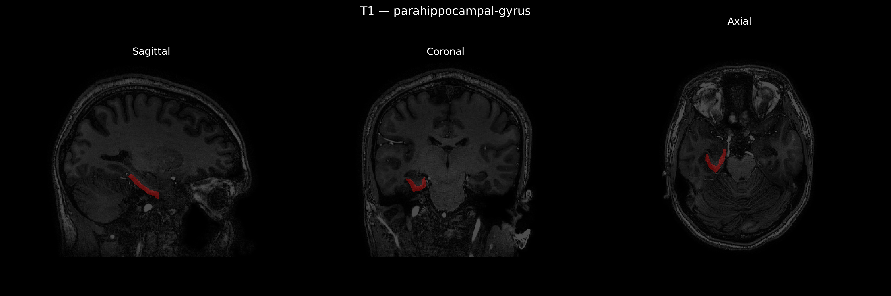
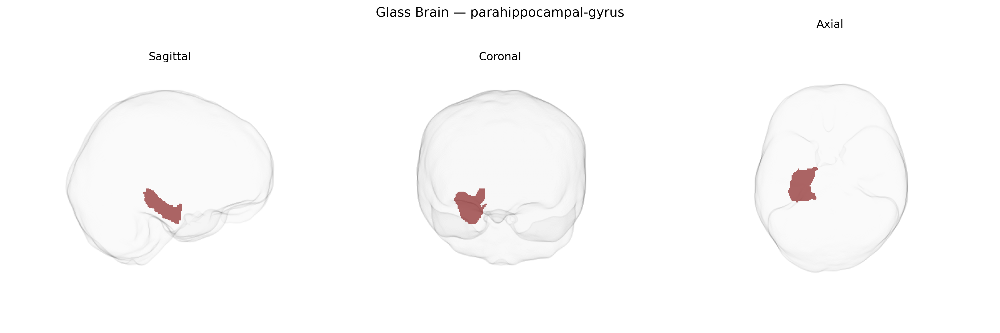

# parahippocampal-gyrus
 
## Overview
 
The right parahippocampal gyrus is a medial temporal lobe cortical region that plays a central role in episodic memory, visuospatial processing, and contextual scene representation. Cytoarchitectonically, it encompasses areas such as the parahippocampal cortex and entorhinal cortex, forming a key interface between neocortical association areas and the hippocampal formation. This gyrus receives highly processed multimodal sensory input and relays it to hippocampal subfields, supporting the encoding and retrieval of environmental layouts, spatial navigation cues, and situational context. Functionally, it is strongly engaged during scene perception, recognition of places and landmarks, and memory for contextual associations, with right-hemisphere dominance often linked to spatial and visuospatial aspects of memory. Clinically, structural or functional alterations in the right parahippocampal gyrus have been associated with temporal lobe epilepsy, Alzheimer’s disease, and certain anxiety and stress-related disorders. [Parahippocampal gyrus](https://en.wikipedia.org/wiki/Parahippocampal_gyrus)
 
The right parahippocampal gyrus, as defined in parcellations such as the brainCOLOR atlas, has shown robust genetic influences in structural MRI GWAS, with SNP-based heritability estimates often in the moderate range and multiple loci reaching genome-wide significance for regional volume or thickness. Variants in or near genes involved in synaptic plasticity, axon guidance, and neurodevelopment (for example, DPP4, SLC39A8, and genes in the MAPT region on 17q21.31) have been associated with parahippocampal morphology in large consortia such as ENIGMA and UK Biobank–based studies, although many findings are shared across medial temporal lobe structures rather than unique to the right parahippocampal gyrus. Genetically influenced alterations of this region have been implicated in Alzheimer’s disease and other dementias, with risk loci in APOE and the MAPT region linked to reduced medial temporal volume and accelerated atrophy, as well as in schizophrenia and bipolar disorder, where common risk variants correlate with parahippocampal and hippocampal–parahippocampal complex abnormalities. Polygenic scores for major depressive disorder, neuroticism, and anxiety-related traits show associations with reduced parahippocampal volume or altered connectivity, while genetic liability for PTSD and episodic memory performance has also been connected to structural and functional variation in this region. Overall, current evidence suggests a polygenic architecture in which risk variants for neurodegenerative and major psychiatric disorders, along with loci influencing general brain development and cognition, contribute to individual differences in right parahippocampal gyrus structure and function, though atlas-specific and strictly lateralized (right-only) genetic effects remain less well characterized.
 
*Overview generated by GPT-4o (2026).*
 
---
 
**Region ID:** 86  
**Hemisphere:** Right  
**Atlas:** brainCOLOR 
 
---
 
## parahippocampal-gyrus – Black Background (Full Brain)
 

 
**Full Quality Version:** <a href="full_black.mp4" download>Download MP4</a>
 
---
 
## parahippocampal-gyrus – White Background (Full Brain)
 

 
**Full Quality Version:** <a href="full_white.mp4" download>Download MP4</a>
 
---

## parahippocampal-gyrus – Black Background (Hemisphere)
 

 
**Full Quality Version:** <a href="hemi_black.mp4" download>Download MP4</a>
 
---
 
## parahippocampal-gyrus – White Background (Hemisphere)
 

 
**Full Quality Version:** <a href="hemi_white.mp4" download>Download MP4</a>
 
---

## Triplanar View – T1 Background
 

 
---
 
## Triplanar View – Ghost Brain
 


