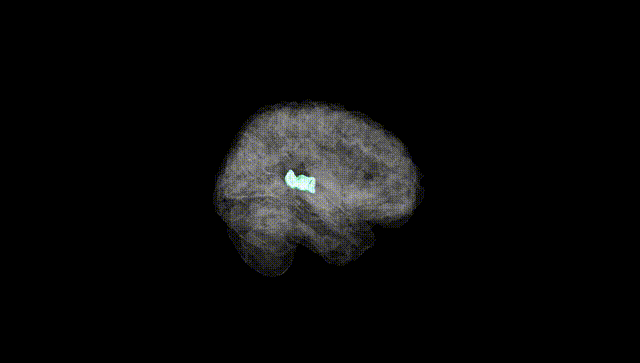
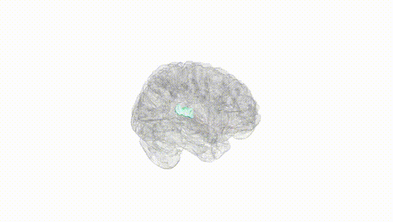
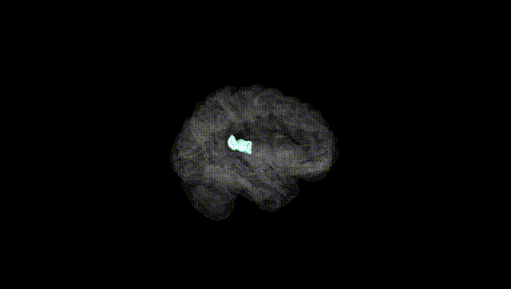
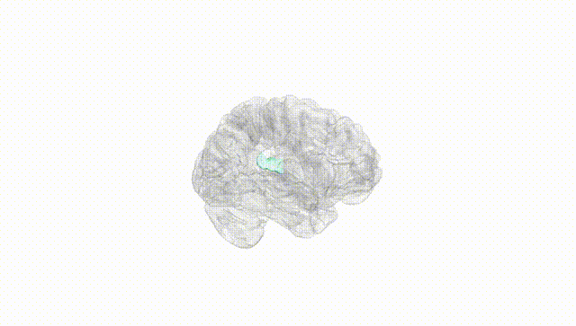
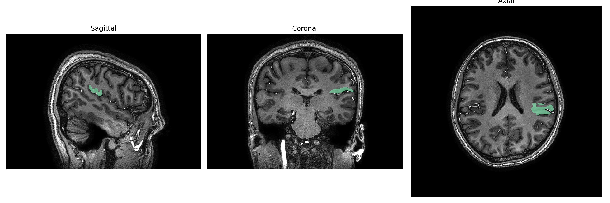
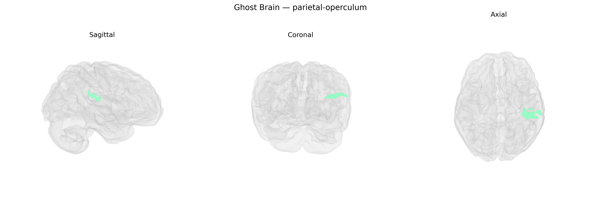

# parietal-operculum
 
## Overview
 
The Left parietal-operculum, as defined in the brainCOLOR Atlas, corresponds largely to portions of the parietal operculum that border the lateral sulcus and overlie the insula, encompassing parts of the secondary somatosensory cortex (S2) and adjacent multimodal association areas in the inferior parietal region. This area participates in higher-order somatosensory processing, including integration of tactile, proprioceptive, and nociceptive inputs, and contributes to sensorimotor integration, body representation, and aspects of tactile object recognition. It is also implicated in bilateral coordination of sensory signals and may play a role in language-related sensorimotor functions due to its proximity to perisylvian cortical regions. There is no direct link for the “Left parietal-operculum” as a standalone article; a closely related structure is the [Parietal operculum](https://en.wikipedia.org/wiki/Parietal_operculum).
 
The left parietal operculum—encompassing parietal portions of the opercular cortex bordering the Sylvian fissure—has been implicated in large-scale imaging genetics and GWAS meta-analyses of cortical structure and function, although findings are typically reported at the parcel, gyral, or network level rather than specifically under the “brainCOLOR Atlas” label. Common variants within or near genes involved in neurodevelopment and synaptic function (for example, MIR137, CNTNAP2, GRIN2B, and genes in glutamatergic and GABAergic pathways) have been associated with inter-individual differences in cortical thickness, surface area, or gyrification in opercular and inferior parietal regions, including the parietal operculum, across ENIGMA and UK Biobank–based studies. Polygenic risk scores for schizophrenia, bipolar disorder, and major depression show associations with structural variation in lateral parietal and opercular areas, and autism spectrum disorder and attention-deficit/hyperactivity disorder GWAS have linked risk variation to altered connectivity within sensorimotor and language-related networks that include the left parietal operculum. This region is also commonly implicated in genetic studies of language, speech and reading abilities, somatosensory and pain processing, and handedness or hemispheric asymmetry, in which variants affecting cortical lateralization and perisylvian language circuits modulate activation or morphology in the left parietal opercular and adjacent supramarginal territories. However, to date, highly specific single-gene or single-variant associations uniquely and reproducibly mapped to the left parietal-operculum parcel (as defined strictly by the brainCOLOR Atlas) remain limited, with most evidence arising from broader parietal or perisylvian phenotypes.
 
*Overview generated by GPT-4o (2026).*
 
---
 
**Region ID:** 91  
**Hemisphere:** Left  
**Atlas:** brainCOLOR 
 
---
 
## parietal-operculum – Black Background (Full Brain)
 

 
**Full Quality Version:** <a href="full_black.mp4" download>Download MP4</a>
 
---
 
## parietal-operculum – White Background (Full Brain)
 

 
**Full Quality Version:** <a href="full_white.mp4" download>Download MP4</a>
 
---

## parietal-operculum – Black Background (Hemisphere)
 

 
**Full Quality Version:** <a href="hemi_black.mp4" download>Download MP4</a>
 
---
 
## parietal-operculum – White Background (Hemisphere)
 

 
**Full Quality Version:** <a href="hemi_white.mp4" download>Download MP4</a>
 
---

## Triplanar View – T1 Background
 

 
---
 
## Triplanar View – Ghost Brain
 


