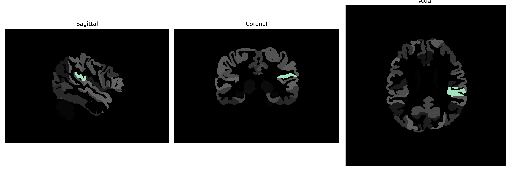

# parietal-operculum

## Overview

The Left parietal-operculum brain region is a part of the cerebral cortex located in the left hemisphere, situated within the parietal lobe. This area is involved in various functions including sensory processing, particularly tactile sensation and spatial awareness. The operculum covers parts of the brain such as the insula and plays a crucial role in integrating sensory information and facilitating motor coordination. Its connections and interactions with adjacent areas contribute to the higher-order processing necessary for complex cognitive tasks. Being a multifaceted region, the parietal-operculum also participates in language processing and is important for distinguishing sounds and speech-related functions.

There is no direct Wikipedia link for the Left parietal-operculum brain region. However, more information can be found about the related area of the parietal lobe here: https://en.wikipedia.org/wiki/Parietal_lobe.

*Overview generated by GPT-4o (2026).*

---

**Region ID:** 91  
**Hemisphere:** Left  
**Atlas:** brainCOLOR 

---

## Full Brain – Black Background

**Full Quality Version:** [Download MP4](full_black.mp4)

---

## Full Brain – White Background

**Full Quality Version:** [Download MP4](full_white.mp4)

---

## Hemisphere Only – Black Background

**Full Quality Version:** [Download MP4](hemi_black.mp4)

---

## Hemisphere Only – White Background

**Full Quality Version:** [Download MP4](hemi_white.mp4)

---

## Triplanar View (Centered on ROI)

