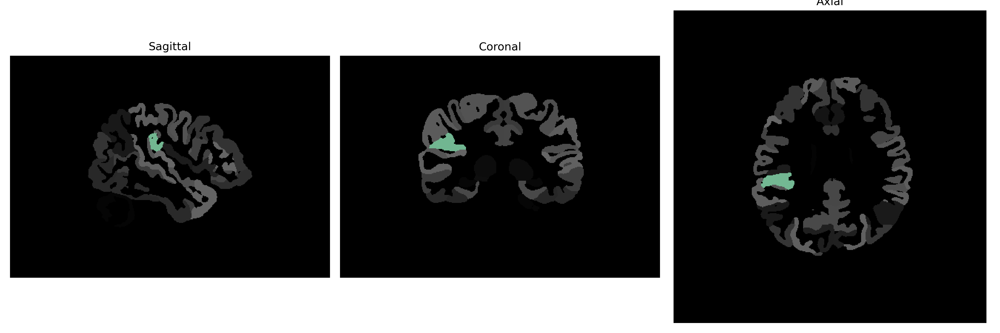

# parietal-operculum

## Overview

The right parietal-operculum is located in the cerebral cortex of the human brain, lying within the lateral sulcus and posterior to the frontal lobe. This region is involved in various sensory processing tasks, including integration of tactile and proprioceptive information, contributing to the perception of spatial orientation and awareness of body position. It serves as a connector between the parietal lobe and the temporal lobe, playing a critical role in processing multisensory information and coordinating complex motor functions. The opercular regions of the brain, including the right parietal-operculum, are partially responsible for integrating sensory stimuli across different modalities, enabling coherent perception and response to environmental changes.

There is no direct Wikipedia link to a description of the right parietal-operculum specifically from the brainCOLOR Atlas. Here is a related link to the parietal lobe, which contains information on its regions and functions: [Parietal Lobe - Wikipedia](https://en.wikipedia.org/wiki/Parietal_lobe).

*Overview generated by GPT-4o (2026).*

---

**Region ID:** 90  
**Hemisphere:** Right  
**Atlas:** brainCOLOR 

---

## Full Brain – Black Background

**Full Quality Version:** [Download MP4](full_black.mp4)

---

## Full Brain – White Background

**Full Quality Version:** [Download MP4](full_white.mp4)

---

## Hemisphere Only – Black Background

**Full Quality Version:** [Download MP4](hemi_black.mp4)

---

## Hemisphere Only – White Background

**Full Quality Version:** [Download MP4](hemi_white.mp4)

---

## Triplanar View (Centered on ROI)

