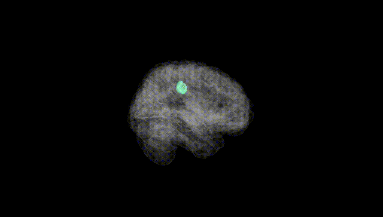
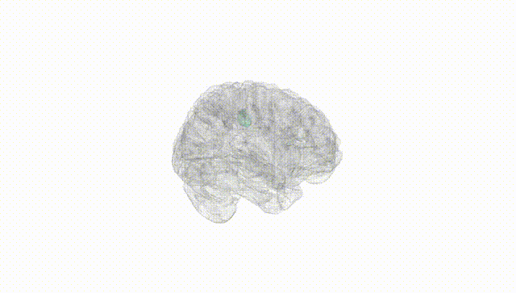
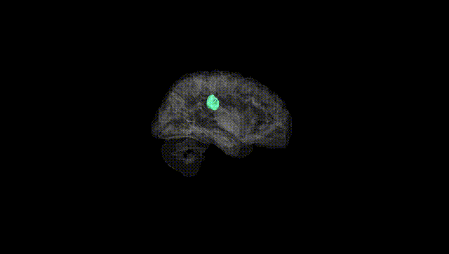
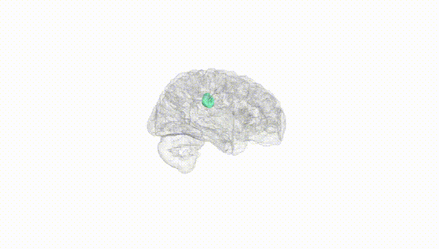
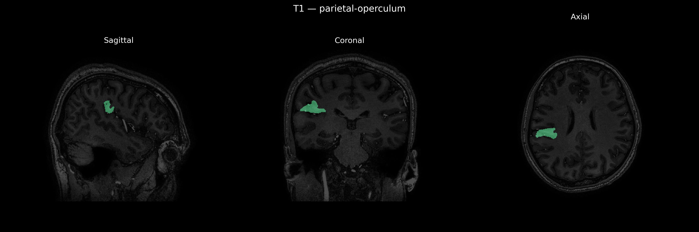
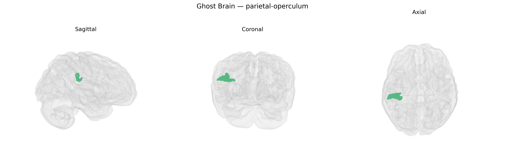

# parietal-operculum
 
## Overview
 
The right parietal operculum is a cortical region located deep within the lateral sulcus, overlying the insula and forming part of the parietal lobe’s contribution to the opercular cortex. Anatomically, it includes parts of the inferior parietal lobule that fold over the Sylvian fissure, adjoining somatosensory areas in the postcentral gyrus and bordering frontal and temporal opercular regions. Functionally, the right parietal operculum is associated with multimodal sensory integration, particularly higher-order somatosensory processing (including tactile discrimination, proprioception, and aspects of body representation), as well as contributions to sensorimotor coordination, spatial attention, and perception of noxious stimuli. This area participates in networks subserving awareness of the contralateral body and peripersonal space and is often implicated in studies of pain perception, touch, and complex sensorimotor transformations. There is no direct link; related structure: [Parietal operculum](https://en.wikipedia.org/wiki/Operculum_(brain)#Parietal_operculum).
 
The right parietal operculum, encompassing secondary somatosensory and multimodal integration areas, has been implicated in several genetic and GWAS-based associations, although findings are typically reported at the level of cortical thickness, surface area, or regional volume rather than the brainCOLOR parcel specifically. Large neuroimaging-genetics consortia (e.g., ENIGMA, UK Biobank) have identified common variants in genes involved in neurodevelopment (such as those in axon guidance, synaptic organization, and neuronal differentiation pathways) that modulate structural measures in parietal opercular and adjacent perisylvian regions, including loci near genes like LPHN3, CADM2, and MAPT in broader parietal or supramarginal-temporal junction areas. These structural variations have, in turn, been associated with cognitive traits (e.g., working memory, language and phonological processing, and multisensory integration) and with risk for neuropsychiatric conditions such as schizophrenia, attention-deficit/hyperactivity disorder, and autism spectrum disorder, where imaging–genetics studies link polygenic risk scores to altered activation or morphology in parietal operculum–related somatosensory and salience networks. Additionally, GWAS of pain sensitivity and chronic pain, as well as sensorimotor and vestibular traits, have highlighted heritable influences on activation patterns and cortical metrics within opercular parietal regions, consistent with this area’s role in nociception and body representation. However, genetic findings specific to the “Right parietal-operculum” label as defined in the brainCOLOR Atlas remain sparse, and most evidence comes from studies mapping nearby or overlapping opercular and perisylvian territories rather than this parcel in isolation.
 
*Overview generated by GPT-4o (2026).*
 
---
 
**Region ID:** 90  
**Hemisphere:** Right  
**Atlas:** brainCOLOR 
 
---
 
## parietal-operculum – Black Background (Full Brain)
 

 
**Full Quality Version:** <a href="full_black.mp4" download>Download MP4</a>
 
---
 
## parietal-operculum – White Background (Full Brain)
 

 
**Full Quality Version:** <a href="full_white.mp4" download>Download MP4</a>
 
---

## parietal-operculum – Black Background (Hemisphere)
 

 
**Full Quality Version:** <a href="hemi_black.mp4" download>Download MP4</a>
 
---
 
## parietal-operculum – White Background (Hemisphere)
 

 
**Full Quality Version:** <a href="hemi_white.mp4" download>Download MP4</a>
 
---

## Triplanar View – T1 Background
 

 
---
 
## Triplanar View – Ghost Brain
 


