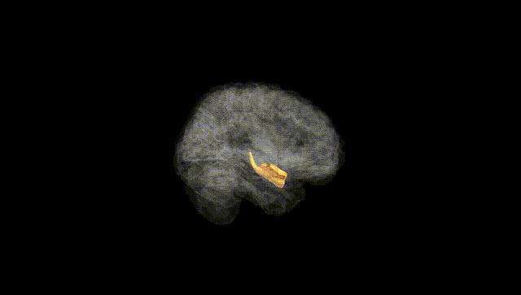
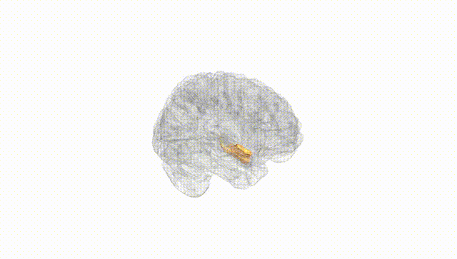
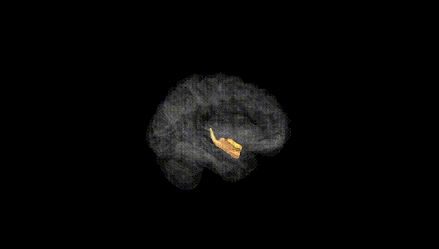
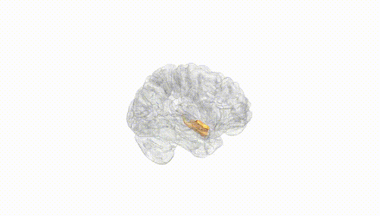
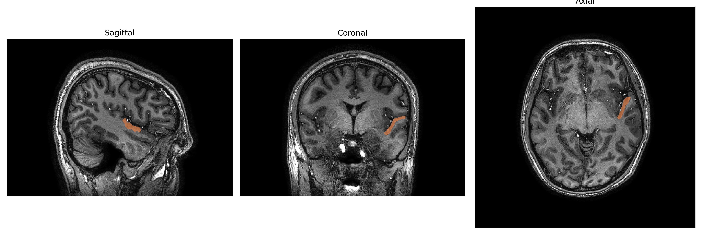
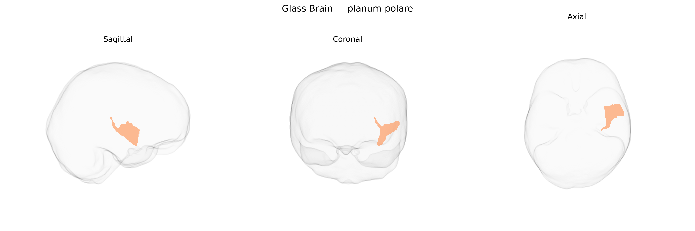

# planum-polare

## Overview

The left planum polare is a cortical region of the superior temporal lobe located anterior to Heschl’s gyrus, forming the most anterior portion of the superior temporal plane on the dorsal surface of the temporal lobe. It is generally considered part of the auditory association cortex and is involved in higher-order processing of complex sounds, including aspects of speech, prosody, and music perception, with possible hemispheric specialization for language-related functions in the left hemisphere. Cytoarchitectonically, it lies within anterior superior temporal areas bordering primary auditory cortex and more lateral temporal association areas, and it is interconnected with other temporal, frontal, and parietal regions participating in auditory, linguistic, and multimodal integration networks. There is no direct Wikipedia link specifically for “left planum polare”; a closely related and encompassing structure is the superior temporal gyrus: https://en.wikipedia.org/wiki/Superior_temporal_gyrus

*Overview generated by GPT-4o (2026).*

---

**Region ID:** 97  
**Hemisphere:** Left  
**Atlas:** brainCOLOR 

---

## planum-polare – Black Background (Full Brain)

**Full Quality Version:** [Download MP4](full_black.mp4)

---

## planum-polare – White Background (Full Brain)

**Full Quality Version:** [Download MP4](full_white.mp4)

---

## planum-polare – Black Background (Hemisphere)

**Full Quality Version:** [Download MP4](hemi_black.mp4)

---

## planum-polare – White Background (Hemisphere)

**Full Quality Version:** [Download MP4](hemi_white.mp4)

---

## Triplanar View – T1 Background

---

## Triplanar View – Ghost Brain


