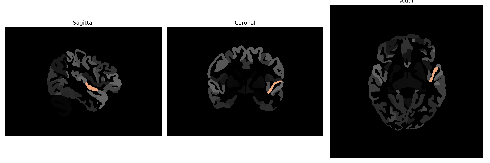

# planum-polare

## Overview

The left planum-polare is a brain region located within the temporal lobe, immediately anterior to the Heschl's gyrus, and is involved in processing non-speech acoustic stimuli and possibly contributing to language comprehension. It is part of the auditory cortex and plays a significant role in the interpretation of complex sounds, such as music and language intonation. The planum polare is asymmetrical in most humans, with the left side often being larger and more functionally active in relation to auditory processing and language. This area is interconnected with various other brain regions, involved in auditory perception and processing.

There is no direct Wikipedia link for the left planum-polare. A related area with more available information is the planum temporale: https://en.wikipedia.org/wiki/Planum_temporale.

*Overview generated by GPT-4o (2026).*

---

**Region ID:** 97  
**Hemisphere:** Left  
**Atlas:** brainCOLOR 

---

## Full Brain – Black Background

**Full Quality Version:** [Download MP4](full_black.mp4)

---

## Full Brain – White Background

**Full Quality Version:** [Download MP4](full_white.mp4)

---

## Hemisphere Only – Black Background

**Full Quality Version:** [Download MP4](hemi_black.mp4)

---

## Hemisphere Only – White Background

**Full Quality Version:** [Download MP4](hemi_white.mp4)

---

## Triplanar View (Centered on ROI)

