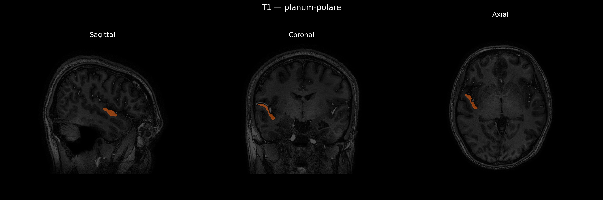
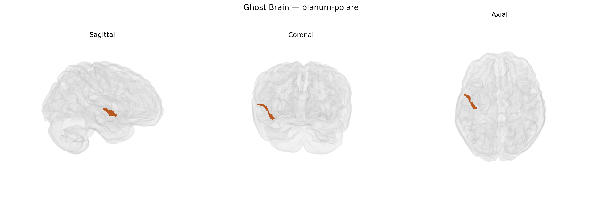

# planum-polare

## Overview

The right planum polare is a cortical region located on the superior temporal gyrus, anterior to Heschl’s gyrus, forming part of the anterolateral temporal lobe and belonging to the auditory association cortex. It is positioned on the dorsal surface of the superior temporal gyrus, bordering the superior temporal sulcus laterally and the temporal pole more anteriorly, with its left-hemisphere counterpart often implicated in higher-order auditory and language-related processing. Cytoarchitectonically, the planum polare is part of the superior temporal cortex transitioning from primary auditory areas (A1) to multimodal association regions, and it participates in complex sound analysis, including aspects of music and speech perception, as well as integration of auditory features over longer temporal windows. There is no direct Wikipedia page for “Right planum-polare”; a related and encompassing structure with a Wikipedia entry is the planum polare of the temporal lobe: https://en.wikipedia.org/wiki/Planum_polare.

*Overview generated by GPT-4o (2026).*

---

**Region ID:** 96  
**Hemisphere:** Right  
**Atlas:** brainCOLOR 

---

## Full Brain – Black Background

**Full Quality Version:** [Download MP4](full_black.mp4)

---

## Full Brain – White Background

**Full Quality Version:** [Download MP4](full_white.mp4)

---

## Hemisphere Only – Black Background

**Full Quality Version:** [Download MP4](hemi_black.mp4)

---

## Hemisphere Only – White Background

**Full Quality Version:** [Download MP4](hemi_white.mp4)

---

## Triplanar View – T1 Background

---

## Triplanar View – Ghost Brain


