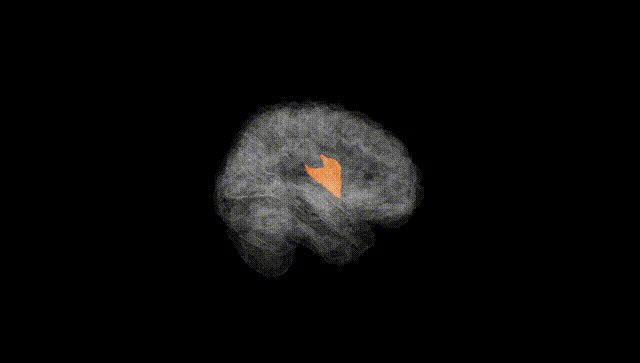
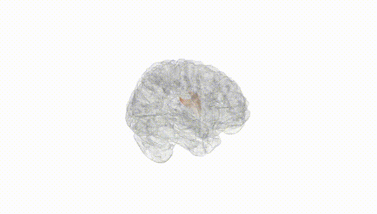
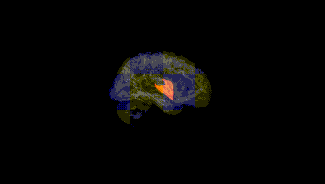
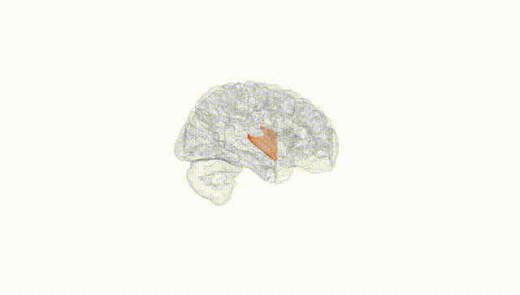
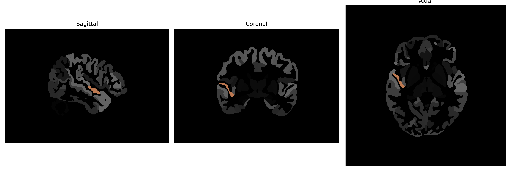

# planum-polare

## Overview

The right planum-polare is a brain region located in the auditory cortex, specifically anterior to the Heschl's gyrus in the superior temporal lobe. It plays a crucial role in auditory processing and is involved in the perception of musical and speech sounds. The planum polare is asymmetrical in function and structure, often exhibiting lateralization, which relates to the dominance of certain cognitive processes including language and music perception. Its connectivity includes associations with other parts of the auditory cortex and the language network. This brain region is especially significant in studies of cognitive neuroscience due to its involvement in the integration of complex auditory stimuli.

There is no direct Wikipedia link specifically for the right planum-polare, but a related area would be the [Planum temporale](https://en.wikipedia.org/wiki/Planum_temporale), which offers insight into its role within the auditory and language processing regions.

*Overview generated by GPT-4o (2026).*

---

**Region ID:** 96  
**Hemisphere:** Right  
**Atlas:** brainCOLOR 

---

## Full Brain – Black Background

**Full Quality Version:** [Download MP4](full_black.mp4)

---

## Full Brain – White Background

**Full Quality Version:** [Download MP4](full_white.mp4)

---

## Hemisphere Only – Black Background

**Full Quality Version:** [Download MP4](hemi_black.mp4)

---

## Hemisphere Only – White Background

**Full Quality Version:** [Download MP4](hemi_white.mp4)

---

## Triplanar View (Centered on ROI)

