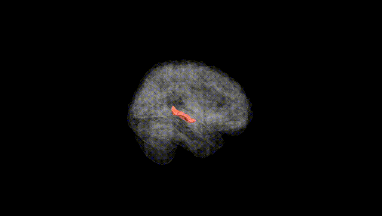
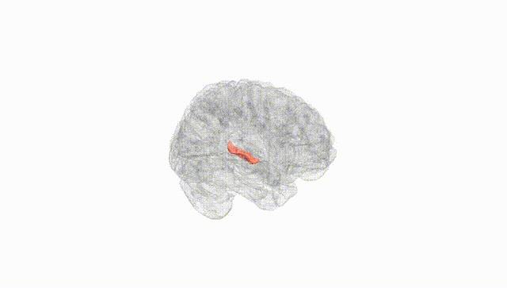
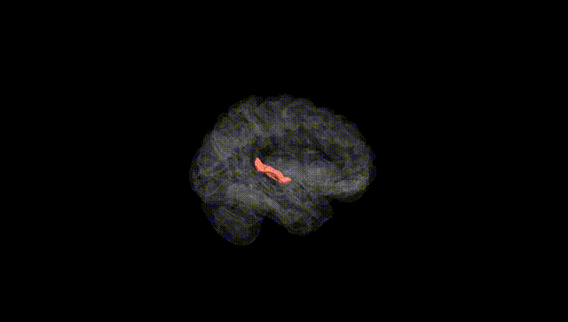
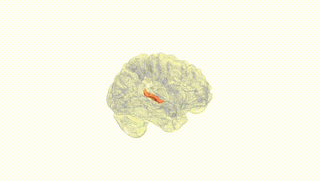
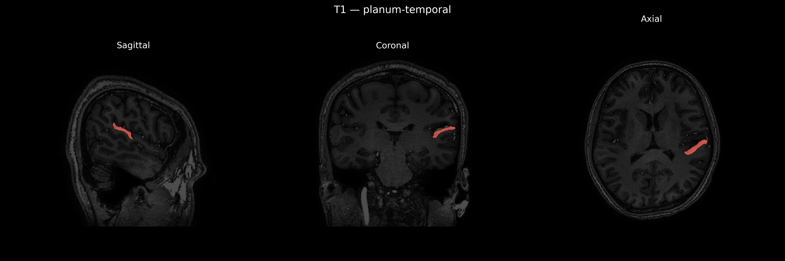
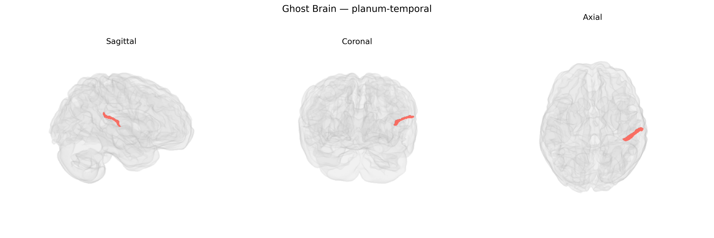

# planum-temporal

## Overview

The left planum temporale is a triangular cortical region located on the superior temporal plane, posterior to Heschl’s gyrus, and forms a major part of the superior temporal lobe associated with auditory and language processing. It lies within the Sylvian fissure (lateral sulcus) and exhibits prominent leftward structural asymmetry in most individuals, often larger on the left than the right, a feature thought to underlie hemispheric specialization for language. Cytoarchitectonically, it overlaps predominantly with posterior portions of the superior temporal gyrus and includes auditory association cortex that integrates complex acoustic patterns such as speech. Functionally, the left planum temporale is implicated in phonological processing, sound localization, and the mapping of acoustic signals to linguistic representations, and its morphology and connectivity have been linked to individual differences in language ability and certain neurodevelopmental disorders. There is no direct Wikipedia link for the “Left planum-temporal” region as labeled in the brainCOLOR Atlas; a related general entry is: https://en.wikipedia.org/wiki/Planum_temporale.

*Overview generated by GPT-4o (2026).*

---

**Region ID:** 101  
**Hemisphere:** Left  
**Atlas:** brainCOLOR 

---

## Full Brain – Black Background

**Full Quality Version:** [Download MP4](full_black.mp4)

---

## Full Brain – White Background

**Full Quality Version:** [Download MP4](full_white.mp4)

---

## Hemisphere Only – Black Background

**Full Quality Version:** [Download MP4](hemi_black.mp4)

---

## Hemisphere Only – White Background

**Full Quality Version:** [Download MP4](hemi_white.mp4)

---

## Triplanar View – T1 Background

---

## Triplanar View – Ghost Brain


