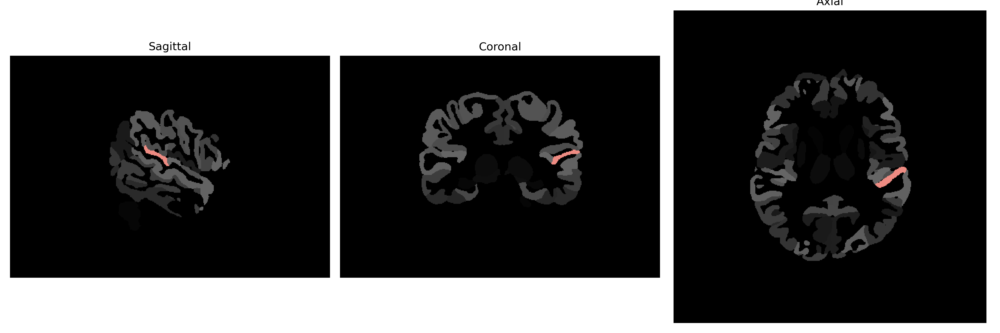

# planum-temporal

## Overview

The left planum temporale is a region located within the superior temporal gyrus, posterior to the auditory cortex, in the left hemisphere of the brain. It plays a significant role in the processing of auditory information and language perception and is often left hemisphere dominant in right-handed individuals. This region is involved in higher-level auditory processing, and its asymmetry is considered crucial for language lateralization, being larger in the left hemisphere in most people. Morphologically, the left planum temporale shows a sophisticated structure that underlies its function in phonetic and phonological processing, as well as in musical processing. Variations in the anatomy of the planum temporale have been associated with language disorders and other neurodevelopmental conditions.

There is no direct Wikipedia link to the Left planum-temporal description from the brainCOLOR Atlas. However, for more information, visit [https://en.wikipedia.org/wiki/Planum_temporale](https://en.wikipedia.org/wiki/Planum_temporale) for a general overview of the region's anatomy and function.

*Overview generated by GPT-4o (2026).*

---

**Region ID:** 101  
**Hemisphere:** Left  
**Atlas:** brainCOLOR 

---

## Full Brain – Black Background

**Full Quality Version:** [Download MP4](full_black.mp4)

---

## Full Brain – White Background

**Full Quality Version:** [Download MP4](full_white.mp4)

---

## Hemisphere Only – Black Background

**Full Quality Version:** [Download MP4](hemi_black.mp4)

---

## Hemisphere Only – White Background

**Full Quality Version:** [Download MP4](hemi_white.mp4)

---

## Triplanar View (Centered on ROI)

