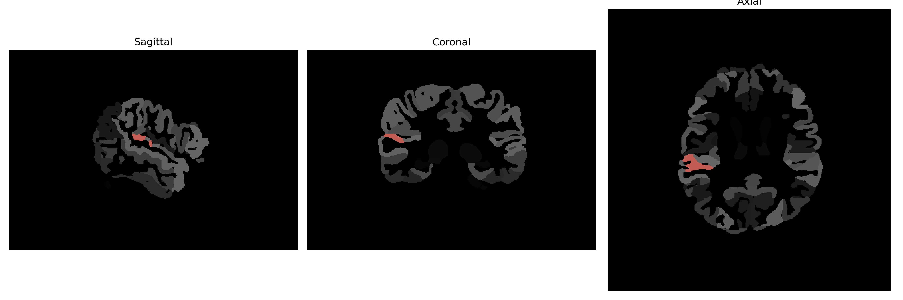

# planum-temporal

## Overview

The right planum temporale is a cortical area within the superior temporal gyrus of the brain, located posterior to the auditory core region and often considered a part of the auditory association cortex. It is highly involved in processing auditory information, particularly in the lateralization and localization of sound, and plays a critical role in speech and language functions. The right planum temporale is asymmetrical across individuals, typically smaller than its left counterpart, which has been associated with language lateralization differences. It is significant in the integration of auditory stimuli with other sensory modalities and is also implicated in musical ability, perception, and auditory memory processing.

There is no direct Wikipedia link for the right planum temporale from the brainCOLOR Atlas. However, a related Wikipedia page on the planum temporale itself is available here: https://en.wikipedia.org/wiki/Planum_temporale.

*Overview generated by GPT-4o (2026).*

---

**Region ID:** 100  
**Hemisphere:** Right  
**Atlas:** brainCOLOR 

---

## Full Brain – Black Background

**Full Quality Version:** [Download MP4](full_black.mp4)

---

## Full Brain – White Background

**Full Quality Version:** [Download MP4](full_white.mp4)

---

## Hemisphere Only – Black Background

**Full Quality Version:** [Download MP4](hemi_black.mp4)

---

## Hemisphere Only – White Background

**Full Quality Version:** [Download MP4](hemi_white.mp4)

---

## Triplanar View (Centered on ROI)

