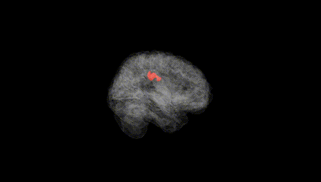
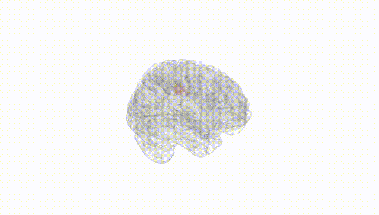
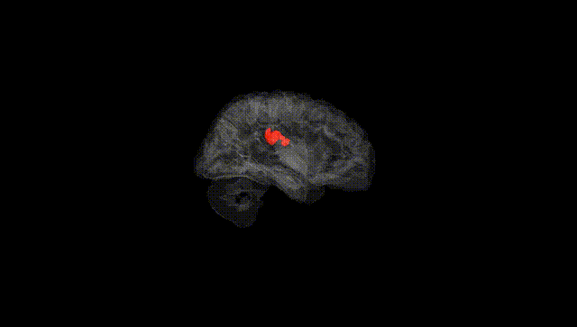
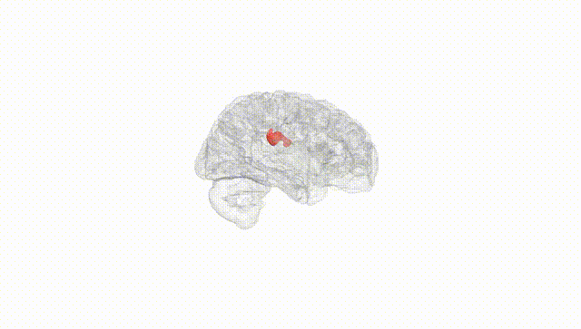
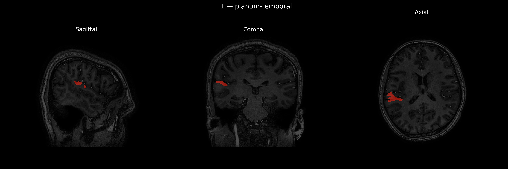
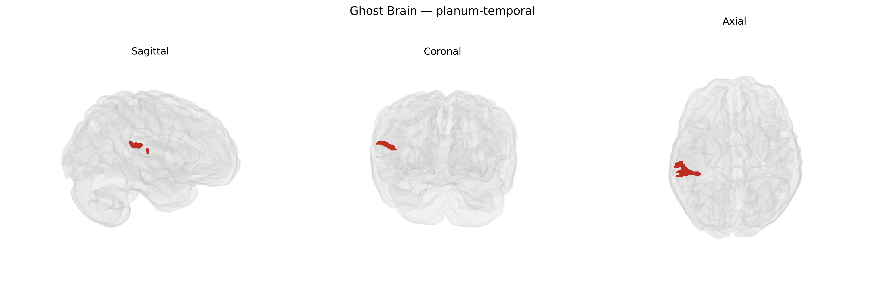

# planum-temporal

## Overview

The right planum temporale is a horizontal, triangular cortical region located on the superior surface of the temporal lobe, posterior to Heschl’s gyrus and forming part of the superior temporal plane, corresponding to the posterior portion of the superior temporal gyrus within the Sylvian fissure. It is cytoarchitectonically associated primarily with auditory association cortex (Brodmann area 22) and is a key component of the perisylvian language network, implicated in higher-order auditory processing, phonological analysis, and aspects of language lateralization, although functional specialization is typically more pronounced in the left hemisphere. The right planum temporale also contributes to spectral and spatial aspects of sound processing, including music and pitch perception. In the brainCOLOR atlas, this region is parcellated as a distinct label reflecting its anatomical boundaries and asymmetry relative to the left side. There is no direct Wikipedia page specifically for the “Right planum temporale”; a related and encompassing structure is described at: https://en.wikipedia.org/wiki/Planum_temporale

*Overview generated by GPT-4o (2026).*

---

**Region ID:** 100  
**Hemisphere:** Right  
**Atlas:** brainCOLOR 

---

## Full Brain – Black Background

**Full Quality Version:** [Download MP4](full_black.mp4)

---

## Full Brain – White Background

**Full Quality Version:** [Download MP4](full_white.mp4)

---

## Hemisphere Only – Black Background

**Full Quality Version:** [Download MP4](hemi_black.mp4)

---

## Hemisphere Only – White Background

**Full Quality Version:** [Download MP4](hemi_white.mp4)

---

## Triplanar View – T1 Background

---

## Triplanar View – Ghost Brain


