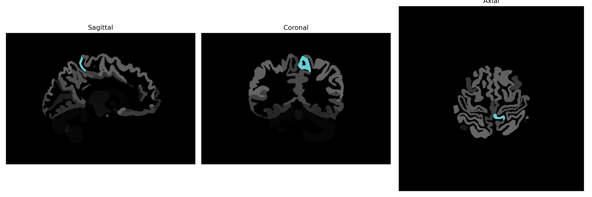

# postcentral-gyrus-medial-segment

## Overview

The Left Postcentral Gyrus Medial Segment is a region of the brain involved in the processing of somatosensory information. It is situated in the postcentral gyrus, part of the parietal lobe, and is responsible for receiving and interpreting sensory information from various parts of the body, particularly in relation to touch, proprioception, and temperature. This region plays a crucial role in the somatosensory system, providing the neural basis for the awareness of body sensations. The postcentral gyrus is organized somatotopically, meaning different areas correspond to sensations from different parts of the body. The medial segment specifically concerns the sensations and perceptions related to the medial parts of the body's surface.

There is no direct Wikipedia link for the Left Postcentral Gyrus Medial Segment. However, a related article can be found at: [Postcentral gyrus](https://en.wikipedia.org/wiki/Postcentral_gyrus).

*Overview generated by GPT-4o (2026).*

---

**Region ID:** 67  
**Hemisphere:** Left  
**Atlas:** brainCOLOR 

---

## Full Brain – Black Background

**Full Quality Version:** [Download MP4](full_black.mp4)

---

## Full Brain – White Background

**Full Quality Version:** [Download MP4](full_white.mp4)

---

## Hemisphere Only – Black Background

**Full Quality Version:** [Download MP4](hemi_black.mp4)

---

## Hemisphere Only – White Background

**Full Quality Version:** [Download MP4](hemi_white.mp4)

---

## Triplanar View (Centered on ROI)

