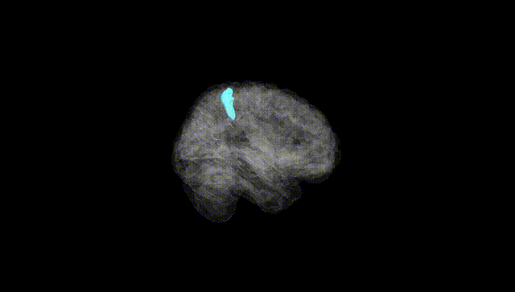
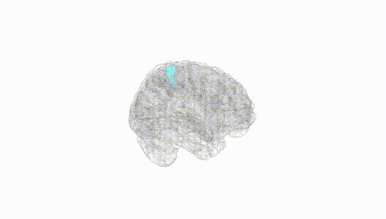
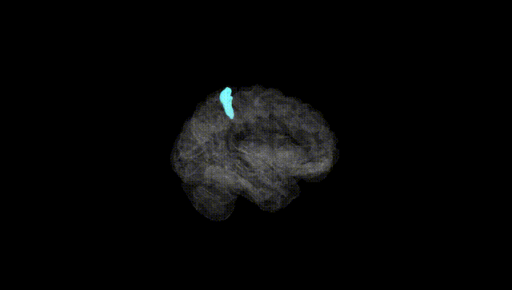
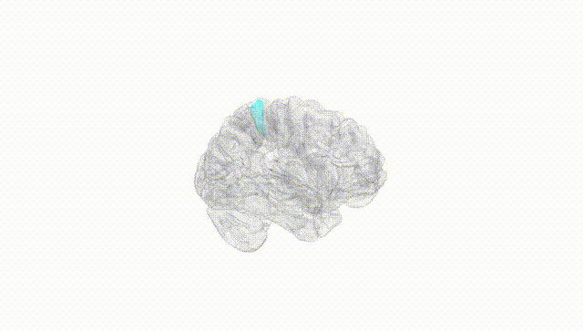
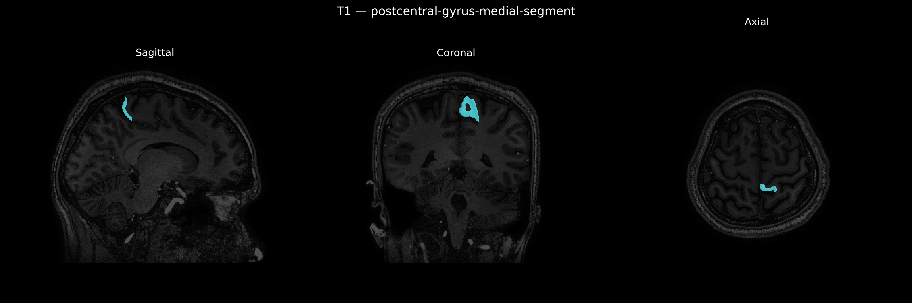
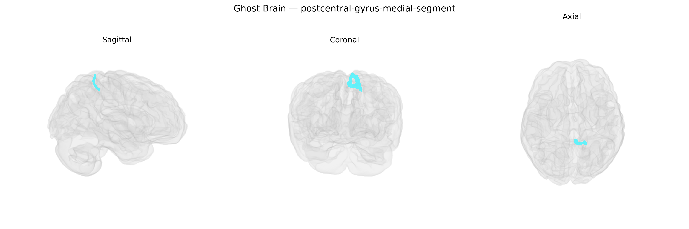

# postcentral-gyrus-medial-segment

## Overview

The left postcentral gyrus, medial segment, corresponds to the medial portion of the primary somatosensory cortex (Brodmann areas 3, 1, and 2) located immediately posterior to the central sulcus on the medial surface of the left hemisphere. This region receives topographically organized afferent input from the ventral posterior nuclei of the thalamus and is particularly involved in processing somatosensory information from contralateral body parts represented medially (e.g., lower limb and trunk), including tactile discrimination, proprioception, and aspects of nociception. Neurons within this medial segment contribute to the construction of a somatotopic body map and participate in higher-order integration of somatic signals relevant for posture, locomotion, and sensorimotor coordination, interacting closely with adjacent sensorimotor regions such as the medial precentral gyrus and supplementary motor areas. There is no direct Wikipedia link for the “Left postcentral-gyrus-medial-segment” as defined in the brainCOLOR Atlas; a closely related and encompassing structure is the postcentral gyrus: https://en.wikipedia.org/wiki/Postcentral_gyrus

*Overview generated by GPT-4o (2026).*

---

**Region ID:** 67  
**Hemisphere:** Left  
**Atlas:** brainCOLOR 

---

## Full Brain – Black Background

**Full Quality Version:** [Download MP4](full_black.mp4)

---

## Full Brain – White Background

**Full Quality Version:** [Download MP4](full_white.mp4)

---

## Hemisphere Only – Black Background

**Full Quality Version:** [Download MP4](hemi_black.mp4)

---

## Hemisphere Only – White Background

**Full Quality Version:** [Download MP4](hemi_white.mp4)

---

## Triplanar View – T1 Background

---

## Triplanar View – Ghost Brain


