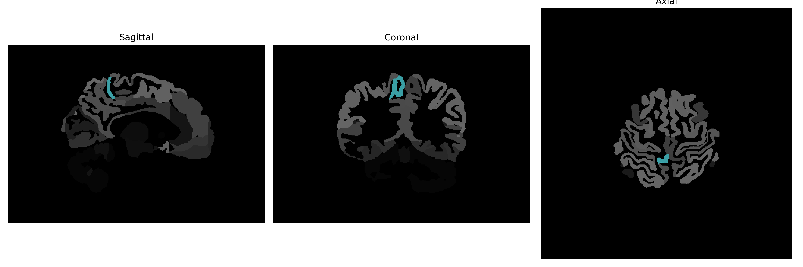

# postcentral-gyrus-medial-segment

## Overview

The Right postcentral-gyrus-medial-segment is a region in the human brain associated with sensory processing and is part of the postcentral gyrus, located in the parietal lobe. This area primarily functions in processing somatosensory information from various body parts, contributing to proprioception and tactile feedback. As a part of the larger somatosensory cortex, it integrates sensory inputs to form an awareness of body positioning and sensations. The medial segment designation indicates its position towards the midline of the brain, contributing to the processing of sensory information from the body's contralateral side. The postcentral gyrus extends along the brain's surface following the central sulcus, hosting a multitude of neural activities critical for sensory integration.

There is no direct link to the Right postcentral-gyrus-medial-segment, but a related article on the postcentral gyrus can be found here: https://en.wikipedia.org/wiki/Postcentral_gyrus

*Overview generated by GPT-4o (2026).*

---

**Region ID:** 66  
**Hemisphere:** Right  
**Atlas:** brainCOLOR 

---

## Full Brain – Black Background

**Full Quality Version:** [Download MP4](full_black.mp4)

---

## Full Brain – White Background

**Full Quality Version:** [Download MP4](full_white.mp4)

---

## Hemisphere Only – Black Background

**Full Quality Version:** [Download MP4](hemi_black.mp4)

---

## Hemisphere Only – White Background

**Full Quality Version:** [Download MP4](hemi_white.mp4)

---

## Triplanar View (Centered on ROI)

