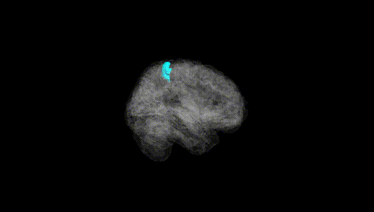
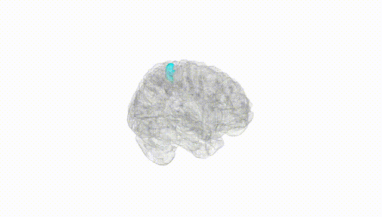
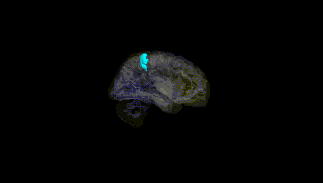
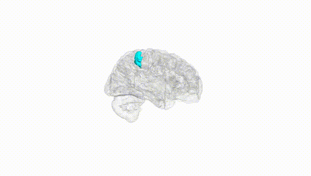
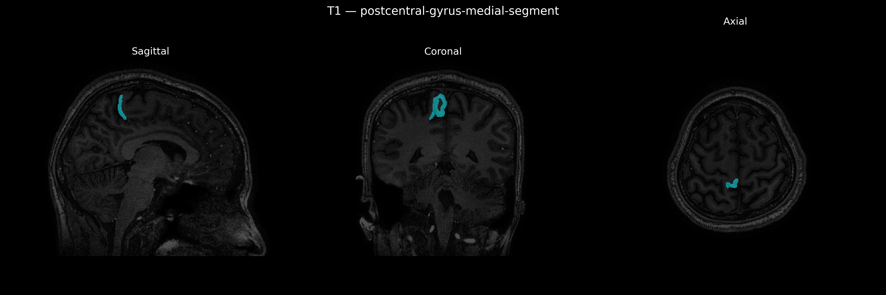
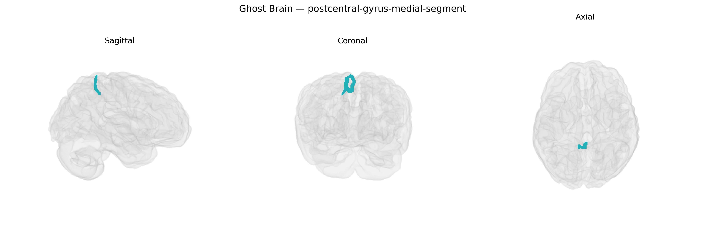

# postcentral-gyrus-medial-segment

## Overview

The right postcentral gyrus medial segment, as defined in the brainCOLOR atlas, corresponds to the medial portion of the primary somatosensory cortex (S1) located on the postcentral gyrus of the right cerebral hemisphere, bordering the interhemispheric fissure and extending into regions representing predominantly lower-limb and trunk somatosensory fields. This cortical area receives dense thalamocortical projections from the ventral posterior nuclei of the thalamus and is organized somatotopically as part of the classic sensory homunculus, with neurons specialized for processing tactile, proprioceptive, and nociceptive information from contralateral body regions. Cytoarchitectonically, it overlaps mainly with Brodmann areas 3, 1, and 2 on the medial aspect of the postcentral gyrus, displaying a prominent granular layer IV characteristic of primary sensory cortices. Functionally, the right medial postcentral region contributes to the perception and integration of somatic sensation from the left lower extremity and midline body parts, and participates in sensorimotor integration by interacting with neighboring motor regions and higher-order parietal association cortices.  

There is no direct Wikipedia page for the “Right postcentral-gyrus-medial-segment” from the brainCOLOR atlas; a closely related structure is the postcentral gyrus: https://en.wikipedia.org/wiki/Postcentral_gyrus

*Overview generated by GPT-4o (2026).*

---

**Region ID:** 66  
**Hemisphere:** Right  
**Atlas:** brainCOLOR 

---

## Full Brain – Black Background

**Full Quality Version:** [Download MP4](full_black.mp4)

---

## Full Brain – White Background

**Full Quality Version:** [Download MP4](full_white.mp4)

---

## Hemisphere Only – Black Background

**Full Quality Version:** [Download MP4](hemi_black.mp4)

---

## Hemisphere Only – White Background

**Full Quality Version:** [Download MP4](hemi_white.mp4)

---

## Triplanar View – T1 Background

---

## Triplanar View – Ghost Brain


