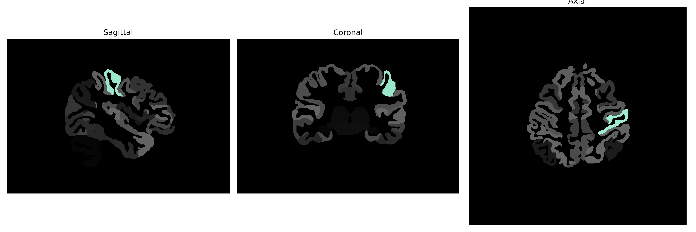

# postcentral-gyrus

## Overview

The Left postcentral gyrus, part of the parietal lobe, is positioned posterior to the central sulcus and is integral to the somatosensory system. This region is responsible for processing tactile information received from the body, including touch, proprioception, nociception, and temperature. Neurons in the postcentral gyrus map sensory input from various body regions in a topographically organized manner, forming part of the primary somatosensory cortex. This organization, known as the sensory homunculus, allows for the discernment of sensory stimuli characteristics and their spatial location. Although specific to the left hemisphere, the functions of the postcentral gyrus contribute greatly to the bilateral processing of sensory information, essential for movement coordination and tactile perception.

There is no direct link to the brainCOLOR Atlas description of the Left postcentral gyrus. However, a related Wikipedia link is provided for the postcentral gyrus: [Postcentral Gyrus - Wikipedia](https://en.wikipedia.org/wiki/Postcentral_gyrus).

*Overview generated by GPT-4o (2026).*

---

**Region ID:** 93  
**Hemisphere:** Left  
**Atlas:** brainCOLOR 

---

## Full Brain – Black Background

**Full Quality Version:** [Download MP4](full_black.mp4)

---

## Full Brain – White Background

**Full Quality Version:** [Download MP4](full_white.mp4)

---

## Hemisphere Only – Black Background

**Full Quality Version:** [Download MP4](hemi_black.mp4)

---

## Hemisphere Only – White Background

**Full Quality Version:** [Download MP4](hemi_white.mp4)

---

## Triplanar View (Centered on ROI)

