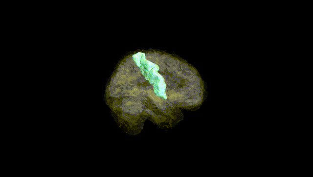
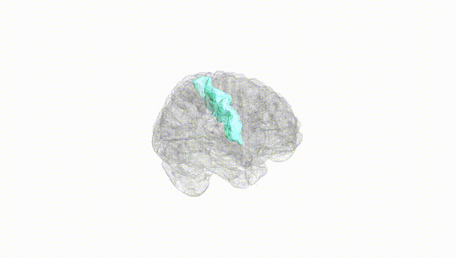
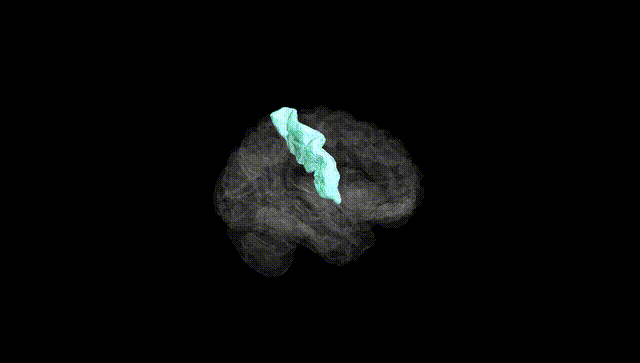
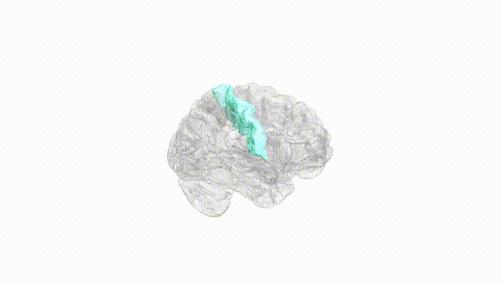
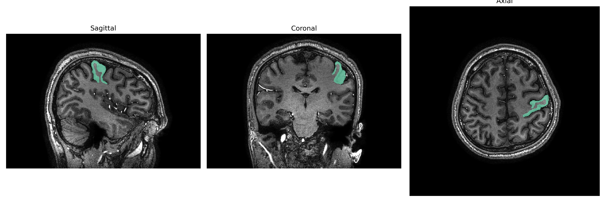
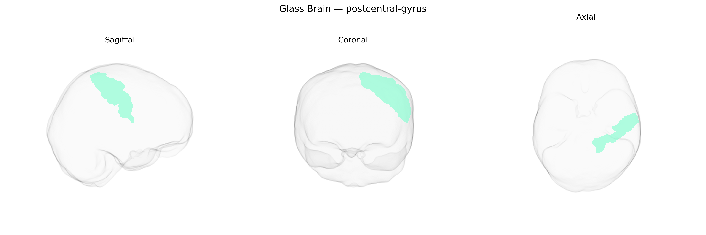

# postcentral-gyrus

## Overview

The left postcentral gyrus is a cortical region in the parietal lobe, located immediately posterior to the central sulcus and corresponding primarily to the primary somatosensory cortex (Brodmann areas 3, 1, and 2). It receives dense thalamocortical input from the ventral posterior nucleus of the thalamus and is organized somatotopically, forming the sensory homunculus that represents contralateral body regions. Neurons in this gyrus process tactile, proprioceptive, and nociceptive information, contributing to conscious perception of touch, body position, and aspects of pain and temperature, and providing essential input for sensorimotor integration with frontal motor regions. Lesions in the left postcentral gyrus can lead to contralateral sensory deficits, including impaired tactile discrimination, astereognosis, and altered body schema, sometimes with higher-order effects on praxis and spatial processing when networks with adjacent parietal association cortices are involved.

Wikipedia URL: https://en.wikipedia.org/wiki/Postcentral_gyrus

*Overview generated by GPT-4o (2026).*

---

**Region ID:** 93  
**Hemisphere:** Left  
**Atlas:** brainCOLOR 

---

## postcentral-gyrus – Black Background (Full Brain)

**Full Quality Version:** [Download MP4](full_black.mp4)

---

## postcentral-gyrus – White Background (Full Brain)

**Full Quality Version:** [Download MP4](full_white.mp4)

---

## postcentral-gyrus – Black Background (Hemisphere)

**Full Quality Version:** [Download MP4](hemi_black.mp4)

---

## postcentral-gyrus – White Background (Hemisphere)

**Full Quality Version:** [Download MP4](hemi_white.mp4)

---

## Triplanar View – T1 Background

---

## Triplanar View – Ghost Brain


