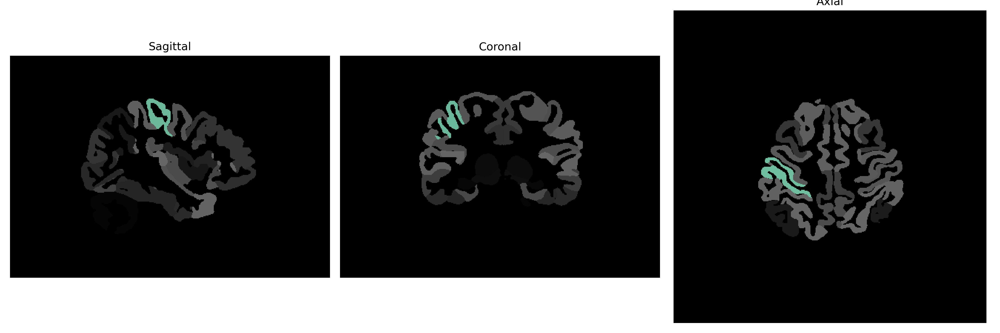

# postcentral-gyrus

## Overview

The Right postcentral gyrus is part of the parietal lobe and is significant in processing somatosensory information from the body. It is known as the primary somatosensory cortex, responsible for processing tactile feedback, proprioception, and sensory localization. After sensory information is conveyed from peripheral receptors and thalamic relays, the postcentral gyrus integrates this data to create a coherent perception of touch, pressure, temperature, and pain. The right hemisphere’s postcentral gyrus is involved in processing information from the left side of the body and plays a crucial role in spatial orientation and conscious sensory perception.

There is no direct link to this description in the brainCOLOR Atlas on Wikipedia. However, here's a URL for a related area: https://en.wikipedia.org/wiki/Postcentral_gyrus.

*Overview generated by GPT-4o (2026).*

---

**Region ID:** 92  
**Hemisphere:** Right  
**Atlas:** brainCOLOR 

---

## Full Brain – Black Background

**Full Quality Version:** [Download MP4](full_black.mp4)

---

## Full Brain – White Background

**Full Quality Version:** [Download MP4](full_white.mp4)

---

## Hemisphere Only – Black Background

**Full Quality Version:** [Download MP4](hemi_black.mp4)

---

## Hemisphere Only – White Background

**Full Quality Version:** [Download MP4](hemi_white.mp4)

---

## Triplanar View (Centered on ROI)

