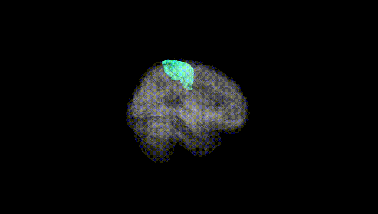
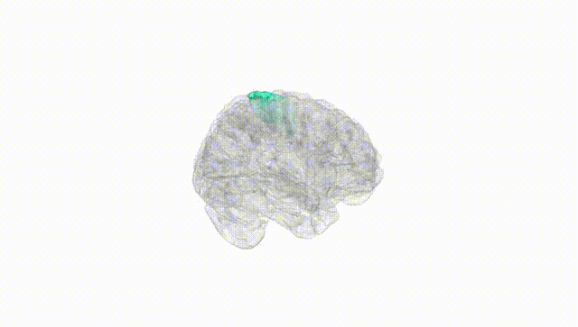
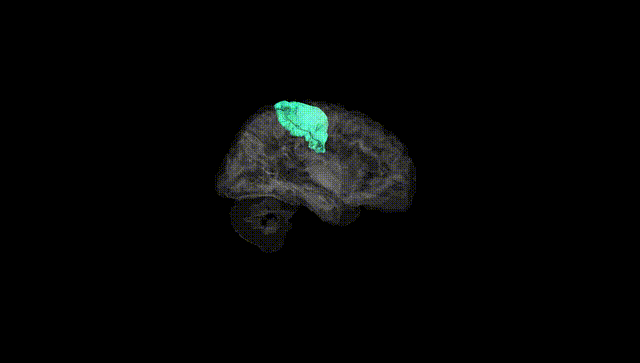
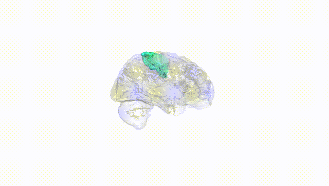
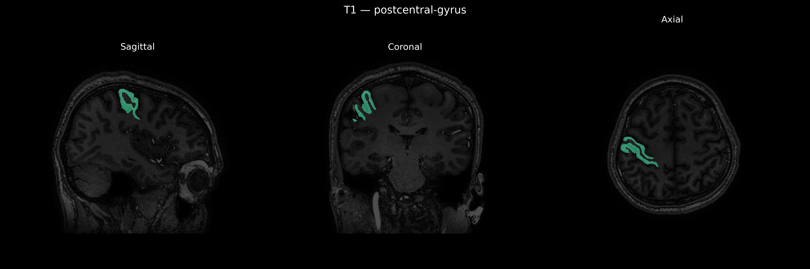
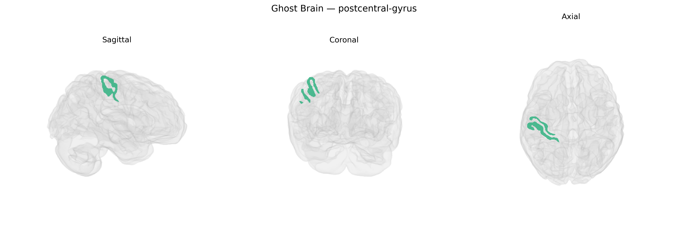

# postcentral-gyrus

## Overview

The right postcentral gyrus is the cortical region of the parietal lobe immediately posterior to the central sulcus, constituting the primary somatosensory cortex (Brodmann areas 3, 1, and 2) for the right hemisphere. It receives dense thalamocortical projections (primarily from the ventral posterior nucleus of the thalamus) conveying tactile, proprioceptive, nociceptive, and temperature information from the contralateral (left) side of the body, arranged in a somatotopic “sensory homunculus” with lower limbs represented medially and face and oral structures laterally. This region participates in the detection and localization of cutaneous stimuli, discrimination of texture and shape, and basic bodily awareness, and it provides sensory input essential for guiding motor actions via dense connectivity with motor and premotor cortices, posterior parietal areas, and subcortical structures. Lesions of the right postcentral gyrus can result in contralateral sensory deficits, including impaired tactile discrimination and, when involving associated parietal areas, neglect phenomena affecting the left side of space.  

There is no direct Wikipedia page specifically for the “Right postcentral gyrus”; a closely related structure is described here: https://en.wikipedia.org/wiki/Postcentral_gyrus

*Overview generated by GPT-4o (2026).*

---

**Region ID:** 92  
**Hemisphere:** Right  
**Atlas:** brainCOLOR 

---

## Full Brain – Black Background

**Full Quality Version:** [Download MP4](full_black.mp4)

---

## Full Brain – White Background

**Full Quality Version:** [Download MP4](full_white.mp4)

---

## Hemisphere Only – Black Background

**Full Quality Version:** [Download MP4](hemi_black.mp4)

---

## Hemisphere Only – White Background

**Full Quality Version:** [Download MP4](hemi_white.mp4)

---

## Triplanar View – T1 Background

---

## Triplanar View – Ghost Brain


