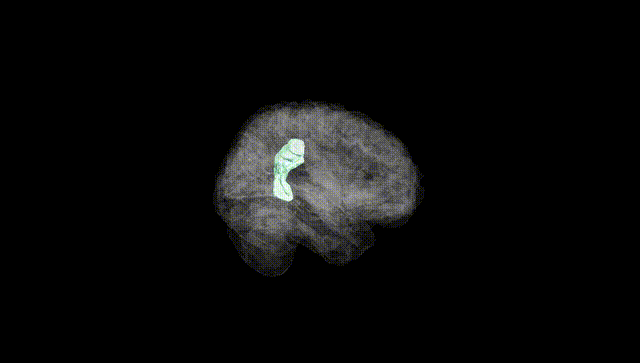
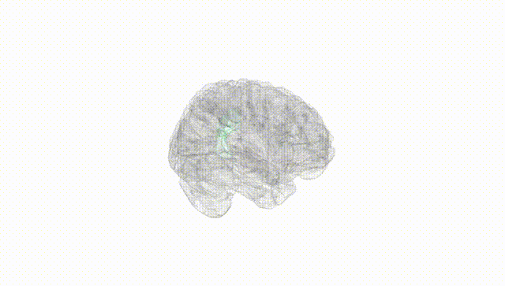
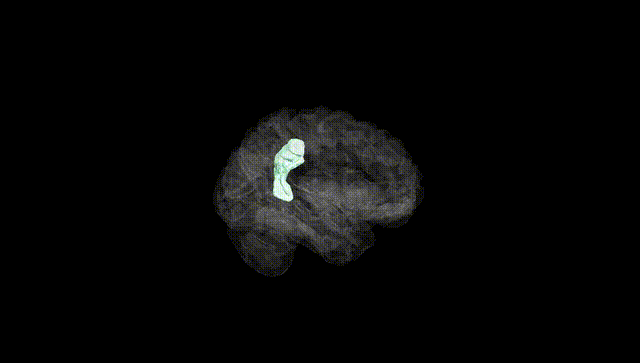
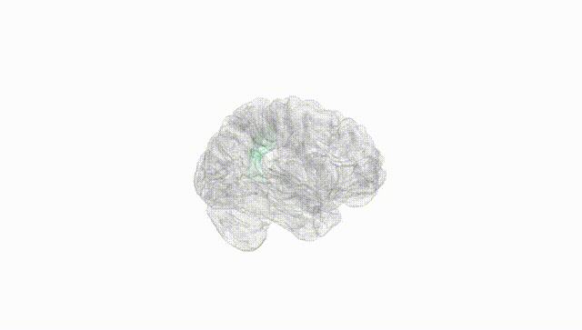
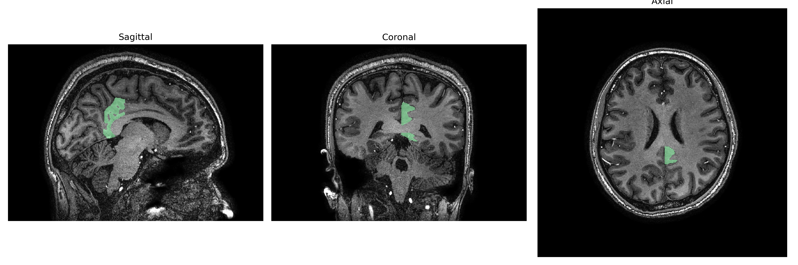
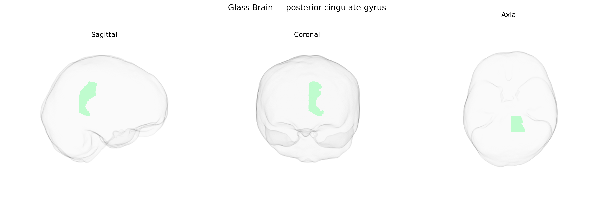

# posterior-cingulate-gyrus
 
## Overview
 
The Left posterior-cingulate-gyrus is a portion of the posterior cingulate cortex located in the medial parietal lobe, bordering the corpus callosum and extending into the precuneus region. Cytoarchitectonically, it is generally associated with Brodmann areas 23 and 31, containing densely interconnected pyramidal neurons that participate in large-scale association networks. Functionally, this region is a core hub of the default mode network, showing high metabolic activity at rest and deactivation during externally focused tasks. It is implicated in internally directed cognition, autobiographical and episodic memory retrieval, spatial orientation, and integration of emotional and contextual information. Altered structure or function of the posterior cingulate gyrus has been associated with neurodegenerative disorders such as Alzheimer’s disease, as well as mood and anxiety disorders, reflecting its role in integrating memory, affective state, and self-referential processing. [Posterior cingulate cortex](https://en.wikipedia.org/wiki/Posterior_cingulate_cortex)
 
Genetic associations involving the left posterior cingulate gyrus (PCG) in the brainCOLOR Atlas largely emerge from neuroimaging GWAS linking common variants to cortical thickness, surface area, volume, and resting-state connectivity of posterior cingulate and adjacent precuneus regions, rather than from region-specific candidate gene studies. Large consortia such as ENIGMA and UK Biobank–based analyses have identified multiple loci—often near genes involved in synaptic function, neurodevelopment, and myelination (e.g., variants in or near genes like PLEKHM1, DAAM1, and others depending on the specific parcellation)—that show genome-wide significant effects on medial parietal morphology, including posterior cingulate measures. These structural and functional metrics in turn have been genetically correlated with Alzheimer’s disease, major depressive disorder, schizophrenia, and general cognitive ability, reflecting the PCG’s role in the default mode network and memory-related processes. Polygenic risk scores for Alzheimer’s disease and related neurodegenerative or psychiatric conditions have been associated with altered posterior cingulate volume or connectivity, with particular emphasis on early hypometabolism and atrophy in Alzheimer’s disease, where APOE-related and other AD-risk variants show downstream effects on this region. Additional GWAS on resting-state networks and intrinsic functional connectivity have linked genetic variation influencing default mode network organization—anchored in the posterior cingulate/precuneus—to traits such as intelligence, educational attainment, neuroticism, and sleep patterns, indicating that the left posterior cingulate gyrus is embedded within polygenic architectures that shape both vulnerability to neuropsychiatric disorders and inter-individual differences in cognition and personality.
 
*Overview generated by GPT-4o (2026).*
 
---
 
**Region ID:** 83  
**Hemisphere:** Left  
**Atlas:** brainCOLOR 
 
---
 
## posterior-cingulate-gyrus – Black Background (Full Brain)
 

 
**Full Quality Version:** <a href="full_black.mp4" download>Download MP4</a>
 
---
 
## posterior-cingulate-gyrus – White Background (Full Brain)
 

 
**Full Quality Version:** <a href="full_white.mp4" download>Download MP4</a>
 
---

## posterior-cingulate-gyrus – Black Background (Hemisphere)
 

 
**Full Quality Version:** <a href="hemi_black.mp4" download>Download MP4</a>
 
---
 
## posterior-cingulate-gyrus – White Background (Hemisphere)
 

 
**Full Quality Version:** <a href="hemi_white.mp4" download>Download MP4</a>
 
---

## Triplanar View – T1 Background
 

 
---
 
## Triplanar View – Ghost Brain
 


