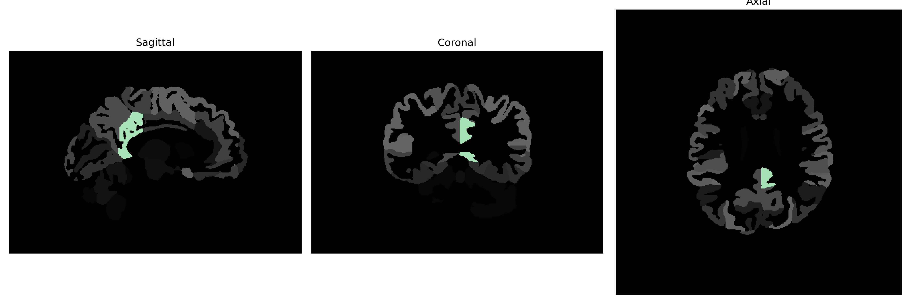

# posterior-cingulate-gyrus

## Overview

The Left posterior-cingulate-gyrus is an integral part of the limbic system, situated in the medial aspect of the cerebral cortex, extending posteriorly from the anterior cingulate gyrus. It plays a crucial role in various cognitive processes, including consciousness, self-referential thought, and the regulation of emotions, while also participating in sensory processing. The posterior cingulate gyrus is involved in the default mode network, which is active during restful states of the brain when a person is awake but not focused on the outside world. This region is also linked to episodic memory retrieval and is often studied for its involvement in different neurodegenerative diseases and psychiatric disorders.

There is no direct link to the Left posterior-cingulate-gyrus description from the brainCOLOR Atlas on Wikipedia. For a related area, the general page on the Cingulate Cortex can be visited: https://en.wikipedia.org/wiki/Cingulate_cortex.

*Overview generated by GPT-4o (2026).*

---

**Region ID:** 83  
**Hemisphere:** Left  
**Atlas:** brainCOLOR 

---

## Full Brain – Black Background

**Full Quality Version:** [Download MP4](full_black.mp4)

---

## Full Brain – White Background

**Full Quality Version:** [Download MP4](full_white.mp4)

---

## Hemisphere Only – Black Background

**Full Quality Version:** [Download MP4](hemi_black.mp4)

---

## Hemisphere Only – White Background

**Full Quality Version:** [Download MP4](hemi_white.mp4)

---

## Triplanar View (Centered on ROI)

