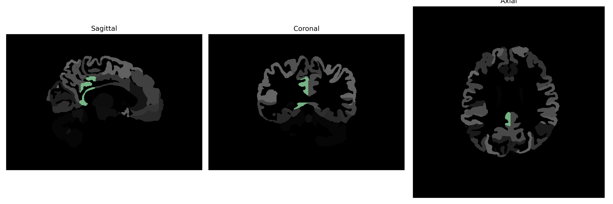

# posterior-cingulate-gyrus

## Overview

The right posterior cingulate gyrus is a component of the limbic cortex located medially in the brain. It plays a pivotal role in several brain functions, including emotion formation and processing, learning, memory, and self-referential thought. Anatomically, it is situated posteriorly to the cingulate sulcus and above the corpus callosum, adjacent to the medial aspects of the parietal lobe. The posterior cingulate cortex is an integral part of the default mode network, which becomes active when the brain is at wakeful rest and not focused on the external environment. This region is involved in the regulation of attention and the integration of emotional and cognitive processes, linking it broadly to consciousness and awareness.

There is no direct Wikipedia link for the Right posterior cingulate gyrus. However, a related page that covers its functions and associations is available at: https://en.wikipedia.org/wiki/Posterior_cingulate_cortex.

*Overview generated by GPT-4o (2026).*

---

**Region ID:** 82  
**Hemisphere:** Right  
**Atlas:** brainCOLOR 

---

## Full Brain – Black Background

**Full Quality Version:** [Download MP4](full_black.mp4)

---

## Full Brain – White Background

**Full Quality Version:** [Download MP4](full_white.mp4)

---

## Hemisphere Only – Black Background

**Full Quality Version:** [Download MP4](hemi_black.mp4)

---

## Hemisphere Only – White Background

**Full Quality Version:** [Download MP4](hemi_white.mp4)

---

## Triplanar View (Centered on ROI)

