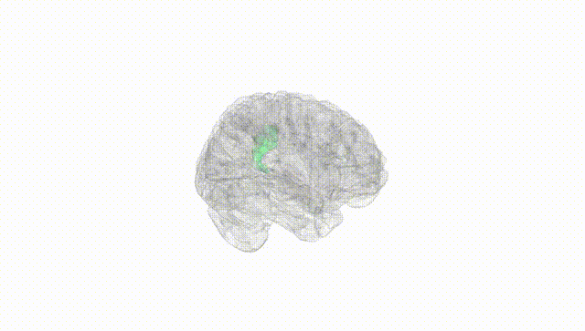
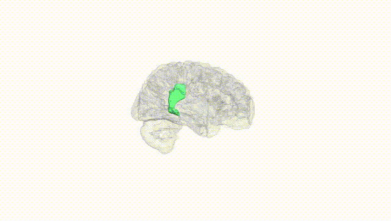
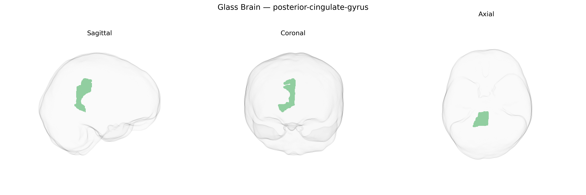

# posterior-cingulate-gyrus

## Overview

The right posterior cingulate gyrus is a subdivision of the cingulate cortex located on the medial surface of the right cerebral hemisphere, posterior to the genu of the corpus callosum and extending toward the splenium. It forms part of the limbic system and is a key hub of the default mode network, showing high metabolic activity at rest. Functionally, the posterior cingulate gyrus is implicated in internally directed cognition, including autobiographical memory retrieval, self-referential processing, visuospatial orientation, and aspects of consciousness and awareness. It maintains extensive connectivity with medial prefrontal, parietal, and medial temporal regions, and its structural or functional alterations have been associated with neurodegenerative disorders such as Alzheimer’s disease, as well as psychiatric conditions including depression. There is no direct Wikipedia link for “Right posterior-cingulate-gyrus (brainCOLOR Atlas label),” but a closely related structure is described here: https://en.wikipedia.org/wiki/Posterior_cingulate.

*Overview generated by GPT-4o (2026).*

---

**Region ID:** 82  
**Hemisphere:** Right  
**Atlas:** brainCOLOR 

---

## posterior-cingulate-gyrus – Black Background (Full Brain)

**Full Quality Version:** [Download MP4](full_black.mp4)

---

## posterior-cingulate-gyrus – White Background (Full Brain)

**Full Quality Version:** [Download MP4](full_white.mp4)

---

## posterior-cingulate-gyrus – Black Background (Hemisphere)

**Full Quality Version:** [Download MP4](hemi_black.mp4)

---

## posterior-cingulate-gyrus – White Background (Hemisphere)

**Full Quality Version:** [Download MP4](hemi_white.mp4)

---

## Triplanar View – T1 Background

---

## Triplanar View – Ghost Brain


