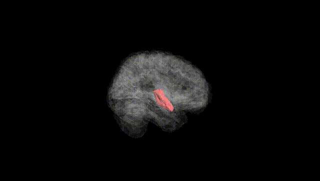
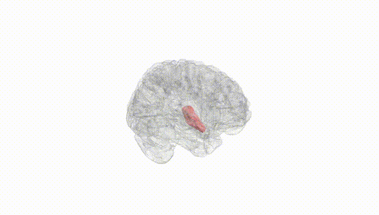
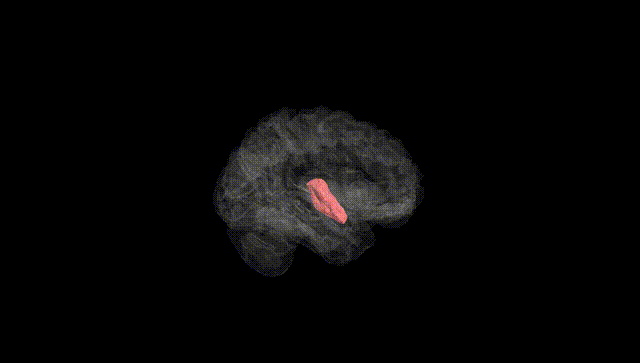
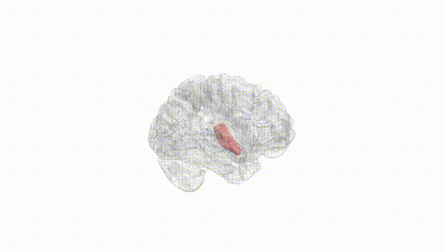
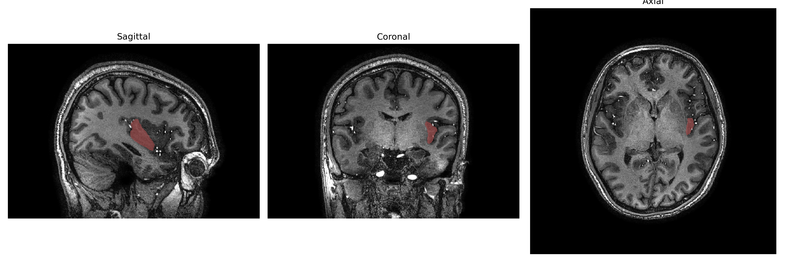
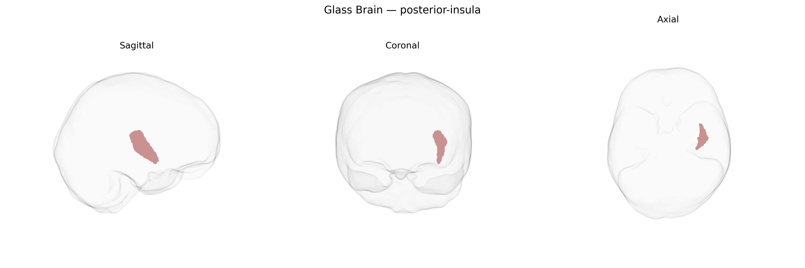

# posterior-insula
 
## Overview
 
The left posterior insula is a subdivision of the insular cortex located deep within the lateral sulcus, forming part of the paralimbic cortex and overlaid by the frontal, parietal, and temporal opercula. Cytoarchitectonically, it is characterized by more granular cortex than the anterior insula and stronger connections with primary and secondary somatosensory cortices, thalamic nuclei, and brainstem autonomic centers. Functionally, the left posterior insula is involved in interoceptive and somatosensory processing, including pain, temperature, visceral sensations, and aspects of sensorimotor integration, as well as contributing to autonomic regulation and components of the salience network. In the brainCOLOR Atlas, it is identified as a lateralized region reflecting hemispheric organization of insular functions and connectivity patterns. There is no direct Wikipedia page for the “left posterior insula”; see the related region [Insular cortex](https://en.wikipedia.org/wiki/Insular_cortex).
 
The left posterior insula, as defined in the brainCOLOR Atlas, has been implicated in several genetic and GWAS findings primarily through broader insular or salience-network analyses rather than region-specific loci. Large-scale neuroimaging genetics consortia (e.g., ENIGMA, UK Biobank–based studies) have identified common variants near genes involved in synaptic function, cortical development, and axon guidance (such as genes in glutamatergic and GABAergic pathways and several neurodevelopmental loci) that influence insular cortical thickness or surface area, with effects often lateralized or extending into posterior insular subdivisions. Polygenic risk scores for major depressive disorder, schizophrenia, bipolar disorder, and autism spectrum disorder show associations with altered insular structure or connectivity, including posterior insula–linked circuits related to interoception and pain processing. GWAS of pain sensitivity, chronic pain, smoking, alcohol use, and anxiety-related traits also implicate insula-centered networks, with genetically influenced differences in posterior insula anatomy or function reported in imaging–genetic studies of nociception, addiction vulnerability, and emotion regulation. However, to date, no widely replicated GWAS signal is known to be uniquely and specifically mapped to the left posterior insula parcel of the brainCOLOR Atlas, and current evidence comes mainly from broader insular or network-level genetic associations whose spatial peaks may overlap this region.
 
*Overview generated by GPT-4o (2026).*
 
---
 
**Region ID:** 89  
**Hemisphere:** Left  
**Atlas:** brainCOLOR 
 
---
 
## posterior-insula – Black Background (Full Brain)
 

 
**Full Quality Version:** <a href="full_black.mp4" download>Download MP4</a>
 
---
 
## posterior-insula – White Background (Full Brain)
 

 
**Full Quality Version:** <a href="full_white.mp4" download>Download MP4</a>
 
---

## posterior-insula – Black Background (Hemisphere)
 

 
**Full Quality Version:** <a href="hemi_black.mp4" download>Download MP4</a>
 
---
 
## posterior-insula – White Background (Hemisphere)
 

 
**Full Quality Version:** <a href="hemi_white.mp4" download>Download MP4</a>
 
---

## Triplanar View – T1 Background
 

 
---
 
## Triplanar View – Ghost Brain
 


