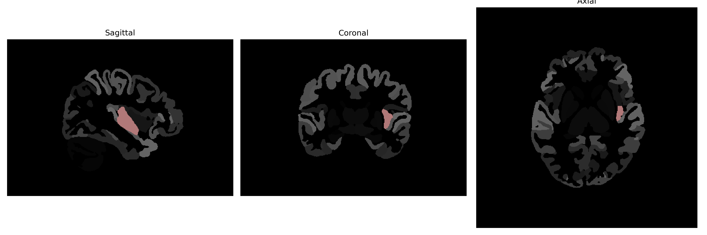

# posterior-insula

## Overview

The Left posterior-insula is a region located in the insular cortex of the brain, which is deeply embedded within the lateral sulcus separating the frontal and temporal lobes. It is involved in a variety of functions, including interoceptive processing, the perception of bodily states, and emotional experience. This area of the insula participates in the integration of sensory information and is critical for the subjective awareness of physiological states and visceral sensations, such as pain and hunger. The posterior insula is also implicated in autonomic control and has been associated with the regulation of sympathetic and parasympathetic responses.

There is no direct Wikipedia link to the Left posterior-insula as described in the brainCOLOR Atlas. A related Wikipedia link to the insular cortex can be accessed here: https://en.wikipedia.org/wiki/Insular_cortex.

*Overview generated by GPT-4o (2026).*

---

**Region ID:** 89  
**Hemisphere:** Left  
**Atlas:** brainCOLOR 

---

## Full Brain – Black Background

**Full Quality Version:** [Download MP4](full_black.mp4)

---

## Full Brain – White Background

**Full Quality Version:** [Download MP4](full_white.mp4)

---

## Hemisphere Only – Black Background

**Full Quality Version:** [Download MP4](hemi_black.mp4)

---

## Hemisphere Only – White Background

**Full Quality Version:** [Download MP4](hemi_white.mp4)

---

## Triplanar View (Centered on ROI)

