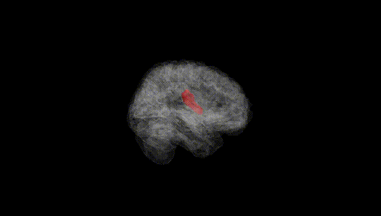
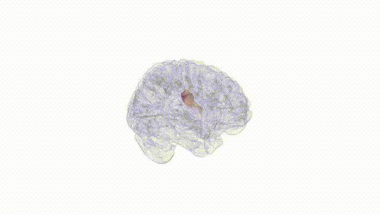
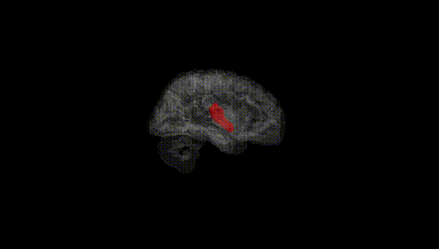
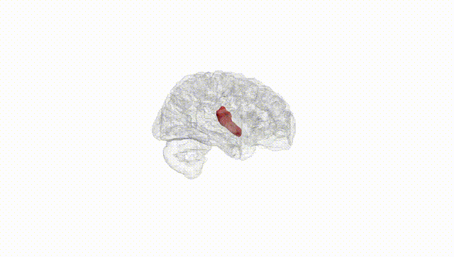
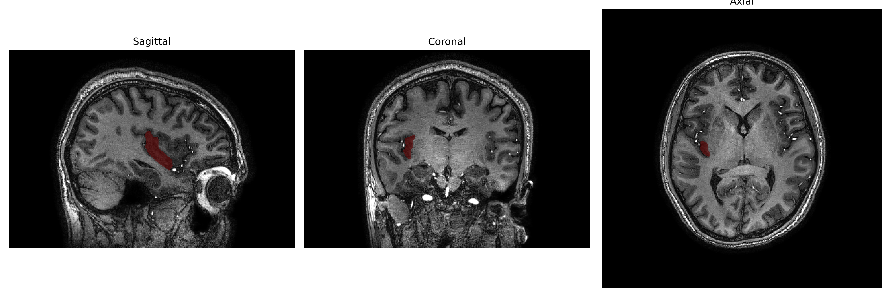
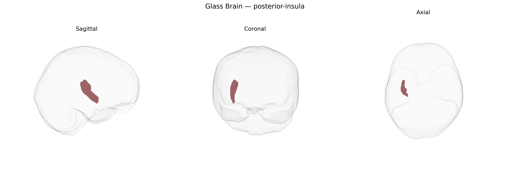

# posterior-insula
 
## Overview
 
The right posterior insula is a subdivision of the insular cortex located deep within the lateral sulcus of the right cerebral hemisphere, forming part of the paralimbic cortex. It is cytoarchitectonically distinct from the more anterior insula and is especially associated with primary interoceptive processing, including representation of visceral states (e.g., cardiovascular and gastrointestinal signals), nociception, temperature, and aspects of somatosensory integration. Functionally, the right posterior insula contributes to sensorimotor integration and bodily awareness, providing foundational signals that are further integrated in anterior insular and cingulate regions to support emotional, autonomic, and homeostatic regulation. In the brainCOLOR atlas, this region is defined as a specific cortical parcel within the broader insular cortex. There is no direct Wikipedia article for the “right posterior insula” as a standalone entry; a closely related structure is the [Insular cortex](https://en.wikipedia.org/wiki/Insular_cortex).
 
The right posterior insula, as defined in the brainCOLOR atlas and related parcellations, has not been the focus of many region-specific genetic studies, but convergent evidence from neuroimaging genetics implicates it in several genetically influenced traits and disorders. Large-scale GWAS of brain structure (e.g., ENIGMA and UK Biobank–based studies) report SNP-heritability for insular cortical thickness and surface area, with common variants near genes such as HMGA2, KTN1, and others in neurodevelopmental and synaptic pathways influencing insular morphology, though most findings are reported for the insula as a whole or its anterior–posterior subdivisions rather than explicitly for the right posterior-insula parcel. Polygenic risk for major depressive disorder, schizophrenia, and bipolar disorder has been associated with altered insular volume or thickness, and insula-related networks that include the posterior insula show genetic correlations with internalizing symptoms, psychosis risk, and neuroticism. GWAS of pain sensitivity and chronic pain identify loci in genes involved in nociception and neuroinflammation (e.g., COMT, TRPM8, CACNA2D3) whose risk alleles have been linked, in imaging–genetics studies, to functional and structural variation in posterior insula, consistent with its role in primary interoceptive and nociceptive processing. Additional associations have been described between insular structure/function and genetic liability for substance use, anxiety traits, and autonomic regulation phenotypes, but these are typically at the level of broader insular or salience-network measures rather than specifically segregated to the right posterior-insula region in the brainCOLOR atlas, and fine-grained parcel-level GWAS for this exact region remain limited or absent in the published literature.
 
*Overview generated by GPT-4o (2026).*
 
---
 
**Region ID:** 88  
**Hemisphere:** Right  
**Atlas:** brainCOLOR 
 
---
 
## posterior-insula – Black Background (Full Brain)
 

 
**Full Quality Version:** <a href="full_black.mp4" download>Download MP4</a>
 
---
 
## posterior-insula – White Background (Full Brain)
 

 
**Full Quality Version:** <a href="full_white.mp4" download>Download MP4</a>
 
---

## posterior-insula – Black Background (Hemisphere)
 

 
**Full Quality Version:** <a href="hemi_black.mp4" download>Download MP4</a>
 
---
 
## posterior-insula – White Background (Hemisphere)
 

 
**Full Quality Version:** <a href="hemi_white.mp4" download>Download MP4</a>
 
---

## Triplanar View – T1 Background
 

 
---
 
## Triplanar View – Ghost Brain
 


