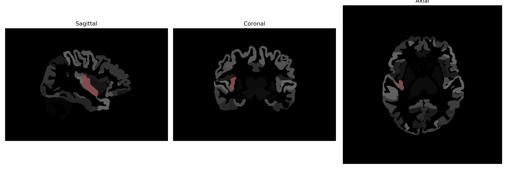

# posterior-insula

## Overview

The right posterior-insula is a subregion of the insular cortex, located deep within the lateral sulcus of the brain. It is involved in the integration of sensory and autonomic information and plays a crucial role in various functions, including interoceptive awareness, pain perception, and homeostatic regulation. The posterior insula is distinguished from the anterior insula by its involvement primarily in sensory rather than emotional processing. Cytoarchitecturally, the insula is characterized by its unique layering and connection patterns that integrate neural networks related to somatosensory, gustatory, visceral, and vestibular systems.  

There is no direct Wikipedia link for the right posterior-insula as described in the brainCOLOR Atlas. However, a link to the insular cortex in general, which includes the posterior insula, is available: https://en.wikipedia.org/wiki/Insular_cortex.

*Overview generated by GPT-4o (2026).*

---

**Region ID:** 88  
**Hemisphere:** Right  
**Atlas:** brainCOLOR 

---

## Full Brain – Black Background

**Full Quality Version:** [Download MP4](full_black.mp4)

---

## Full Brain – White Background

**Full Quality Version:** [Download MP4](full_white.mp4)

---

## Hemisphere Only – Black Background

**Full Quality Version:** [Download MP4](hemi_black.mp4)

---

## Hemisphere Only – White Background

**Full Quality Version:** [Download MP4](hemi_white.mp4)

---

## Triplanar View (Centered on ROI)

