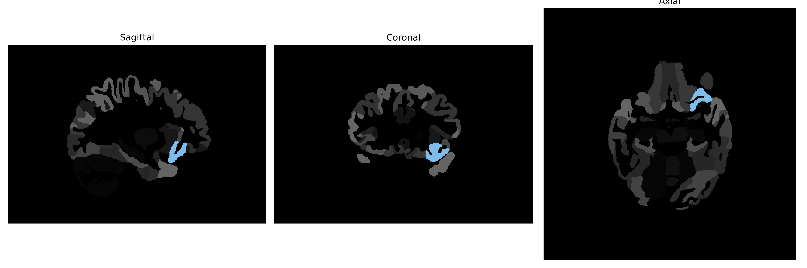

# posterior-orbital-gyrus

## Overview

The Left posterior-orbital-gyrus is a brain region situated in the orbital part of the frontal lobe, specifically located on the ventral surface of the frontal cortex. It plays a role in the integration of sensory information and decision-making processes, often contributing to the modulation of social and emotional behaviors. This region is involved in higher-order cognitive functions, such as personality expression and the regulation of complex behavior. It is also associated with processing rewards and punishments, contributing to adaptive behavioral strategies. The brainCOLOR Atlas categorizes it as a distinct lateral structure, providing detailed anatomical and functional insights within the broader scope of the frontal lobe.

There is no direct Wikipedia link to the Left posterior-orbital-gyrus. For related information, refer to: https://en.wikipedia.org/wiki/Frontal_lobe.

*Overview generated by GPT-4o (2026).*

---

**Region ID:** 95  
**Hemisphere:** Left  
**Atlas:** brainCOLOR 

---

## Full Brain – Black Background

**Full Quality Version:** [Download MP4](full_black.mp4)

---

## Full Brain – White Background

**Full Quality Version:** [Download MP4](full_white.mp4)

---

## Hemisphere Only – Black Background

**Full Quality Version:** [Download MP4](hemi_black.mp4)

---

## Hemisphere Only – White Background

**Full Quality Version:** [Download MP4](hemi_white.mp4)

---

## Triplanar View (Centered on ROI)

