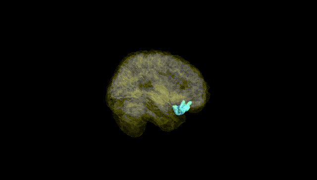
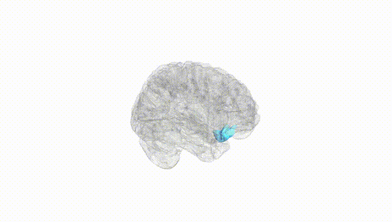
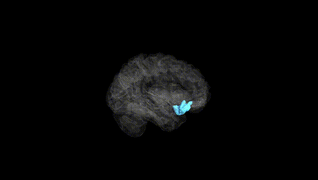
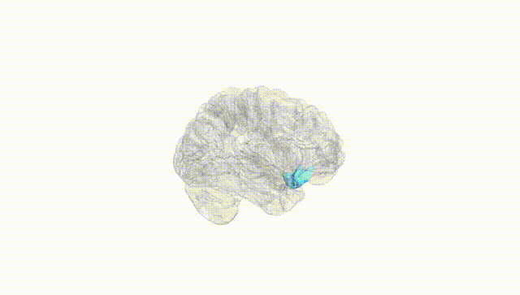
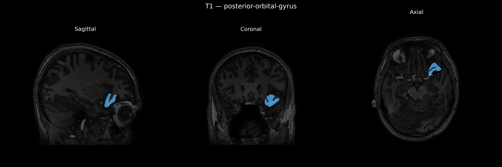
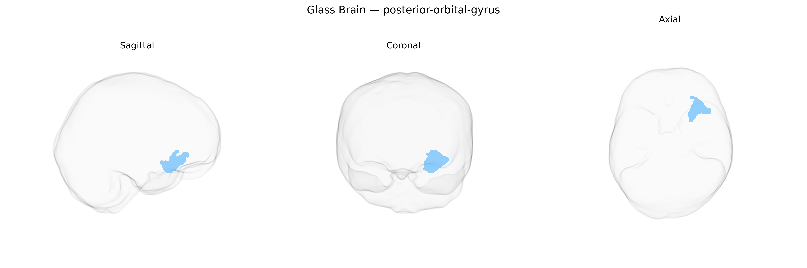

# posterior-orbital-gyrus
 
## Overview
 
The left posterior orbital gyrus is a cortical region located on the ventral surface of the frontal lobe within the orbitofrontal cortex, situated posteriorly relative to the anterior orbital gyri and overlying the orbital plate of the frontal bone. It participates in networks involved in reward valuation, affective processing, decision-making, and the integration of sensory and visceral information that underlies adaptive, goal-directed behavior. Cytoarchitectonically, it contains granular and dysgranular frontal cortex and is interconnected with limbic structures such as the amygdala and hippocampus, as well as with sensory association cortices and other prefrontal areas. Through these connections, the left posterior orbital gyrus contributes to the modulation of emotional responses, social cognition, and the regulation of autonomic and endocrine functions in response to changing environmental contingencies. There is no direct link for this specific subregion; a related structure containing it is the [Orbitofrontal cortex](https://en.wikipedia.org/wiki/Orbitofrontal_cortex).
 
The left posterior orbital gyrus, a ventral prefrontal region implicated in reward valuation, affective processing, and social cognition, has been indirectly linked to several genetic associations through imaging-genetics and GWAS of cortical morphology and neuropsychiatric traits, though few studies target this parcel specifically as defined in the brainCOLOR Atlas. Large-scale GWAS of cortical thickness and surface area (e.g., ENIGMA, UK Biobank) have reported associations between common variants near genes involved in neurodevelopment, synaptic function, and cortical patterning (such as MIR137, GRIN2A, and genes in Wnt and cadherin pathways) and structural variation in orbitofrontal and adjacent ventromedial prefrontal regions that likely overlap the left posterior orbital gyrus. These orbitofrontal measures have in turn been genetically correlated with risk for major depressive disorder, schizophrenia, bipolar disorder, obsessive-compulsive disorder, and substance use, as well as with neuroticism, risk-taking, and cognitive performance, suggesting shared polygenic influences on both regional morphology and behavior. Additionally, GWAS of functional connectivity and task-based activation implicating orbitofrontal and posterior orbital sectors have identified polygenic overlap with depression, anxiety, obesity-related traits, and addictive behaviors, although specific SNP–parcel associations for the left posterior orbital gyrus in the brainCOLOR parcellation remain sparse and are generally inferred from broader orbitofrontal or ventromedial prefrontal loci rather than reported as region-specific findings.
 
*Overview generated by GPT-4o (2026).*
 
---
 
**Region ID:** 95  
**Hemisphere:** Left  
**Atlas:** brainCOLOR 
 
---
 
## posterior-orbital-gyrus – Black Background (Full Brain)
 

 
**Full Quality Version:** <a href="full_black.mp4" download>Download MP4</a>
 
---
 
## posterior-orbital-gyrus – White Background (Full Brain)
 

 
**Full Quality Version:** <a href="full_white.mp4" download>Download MP4</a>
 
---

## posterior-orbital-gyrus – Black Background (Hemisphere)
 

 
**Full Quality Version:** <a href="hemi_black.mp4" download>Download MP4</a>
 
---
 
## posterior-orbital-gyrus – White Background (Hemisphere)
 

 
**Full Quality Version:** <a href="hemi_white.mp4" download>Download MP4</a>
 
---

## Triplanar View – T1 Background
 

 
---
 
## Triplanar View – Ghost Brain
 


