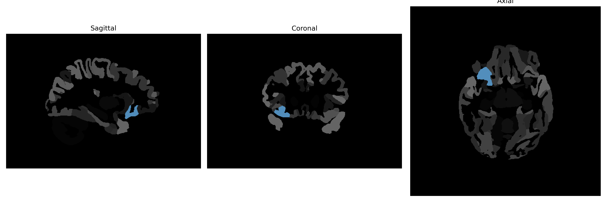

# posterior-orbital-gyrus

## Overview

The Right posterior-orbital-gyrus is part of the orbital gyri located on the ventral surface of the frontal lobe, near the orbital part of the brain. It is involved in various functions related to decision-making, social behaviors, and emotional processing. This brain region forms part of the orbitofrontal cortex, which has been associated with evaluating rewards and punishments, as well as regulating impulsive behavior. The posterior location of this gyrus implies a potential role in integrating sensory input for subsequent processing in more anterior regions. While detailed and specific information about the Right posterior-orbital-gyrus may not be extensively covered in lay resources, it is a component of the broader orbitofrontal cortex complex, contributing to its critical functions in cognition and behavior.

There is no direct Wikipedia link to the Right posterior-orbital-gyrus. However, more information can be accessed from the Wikipedia entry on the Orbitofrontal Cortex: [Orbitofrontal Cortex Wikipedia](https://en.wikipedia.org/wiki/Orbitofrontal_cortex).

*Overview generated by GPT-4o (2026).*

---

**Region ID:** 94  
**Hemisphere:** Right  
**Atlas:** brainCOLOR 

---

## Full Brain – Black Background

**Full Quality Version:** [Download MP4](full_black.mp4)

---

## Full Brain – White Background

**Full Quality Version:** [Download MP4](full_white.mp4)

---

## Hemisphere Only – Black Background

**Full Quality Version:** [Download MP4](hemi_black.mp4)

---

## Hemisphere Only – White Background

**Full Quality Version:** [Download MP4](hemi_white.mp4)

---

## Triplanar View (Centered on ROI)

