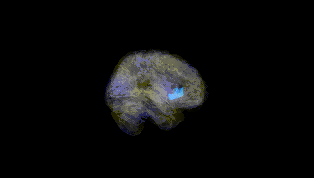
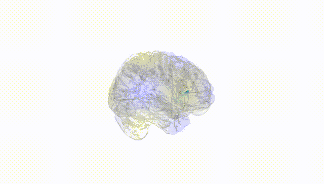
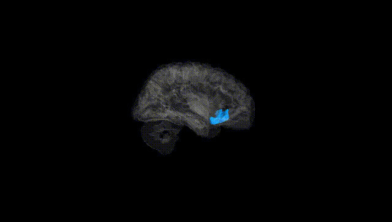
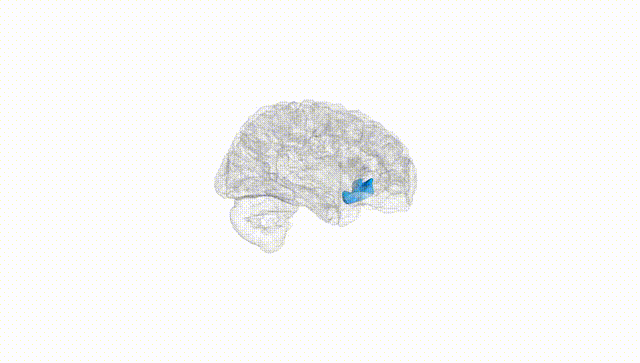
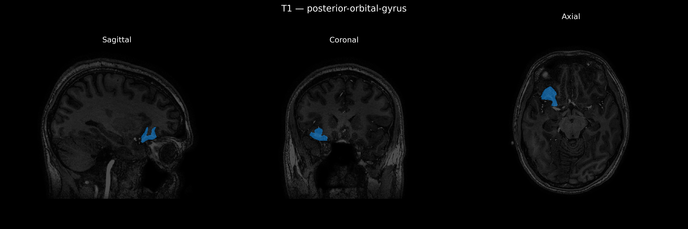
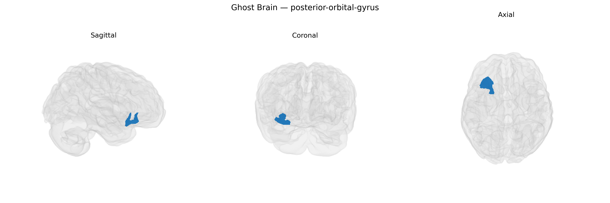

# posterior-orbital-gyrus

## Overview

The right posterior orbital gyrus is a cortical region located on the ventral surface of the frontal lobe within the orbital (orbitofrontal) cortex, as defined in the brainCOLOR Atlas parcellation scheme. It lies posteriorly on the orbital surface, bordering more anterior orbital gyri and adjacent to structures such as the gyrus rectus and medial orbitofrontal cortex, and is positioned above the orbits and anterior to the anterior cranial fossa. Functionally, the posterior orbital region is generally associated with higher-order processes including value-based decision making, reward evaluation, emotional and social behavior, and integration of sensory information for affective and motivational control, though specific functional attributions for this exact parcellated subregion remain more inferential and based on broader orbitofrontal cortex research. There is no direct Wikipedia page for the “right posterior orbital gyrus”; a closely related and encompassing structure is the orbitofrontal cortex: https://en.wikipedia.org/wiki/Orbitofrontal_cortex.

*Overview generated by GPT-4o (2026).*

---

**Region ID:** 94  
**Hemisphere:** Right  
**Atlas:** brainCOLOR 

---

## Full Brain – Black Background

**Full Quality Version:** [Download MP4](full_black.mp4)

---

## Full Brain – White Background

**Full Quality Version:** [Download MP4](full_white.mp4)

---

## Hemisphere Only – Black Background

**Full Quality Version:** [Download MP4](hemi_black.mp4)

---

## Hemisphere Only – White Background

**Full Quality Version:** [Download MP4](hemi_white.mp4)

---

## Triplanar View – T1 Background

---

## Triplanar View – Ghost Brain


