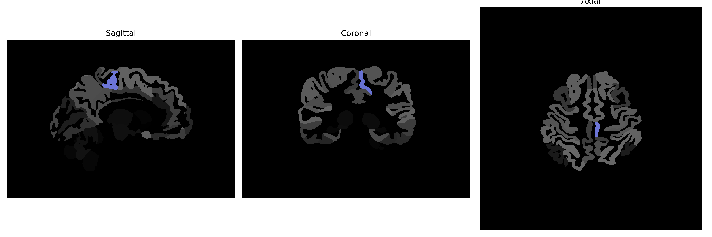

# precentral-gyrus-medial-segment

## Overview

The Left Precentral Gyrus Medial Segment is a specialized region of the precentral gyrus, which is primarily associated with motor control. Situated in the motor cortex, this segment is responsible for the voluntary movement of body parts and is crucial in motor planning and execution. Neurons within this region project to motor neurons in the spinal cord to initiate and regulate muscle contractions. Structural imaging studies show that it is located medially on the lateral aspect of the frontal lobe, occupying part of Brodmann area 4. It plays a pivotal role in the initiation and coordination of complex voluntary movements, particularly for the body's contralateral side.

There is no direct Wikipedia link for the Left Precentral Gyrus Medial Segment. However, a related area, the precentral gyrus, can be found at: https://en.wikipedia.org/wiki/Precentral_gyrus

*Overview generated by GPT-4o (2026).*

---

**Region ID:** 69  
**Hemisphere:** Left  
**Atlas:** brainCOLOR 

---

## Full Brain – Black Background

**Full Quality Version:** [Download MP4](full_black.mp4)

---

## Full Brain – White Background

**Full Quality Version:** [Download MP4](full_white.mp4)

---

## Hemisphere Only – Black Background

**Full Quality Version:** [Download MP4](hemi_black.mp4)

---

## Hemisphere Only – White Background

**Full Quality Version:** [Download MP4](hemi_white.mp4)

---

## Triplanar View (Centered on ROI)

