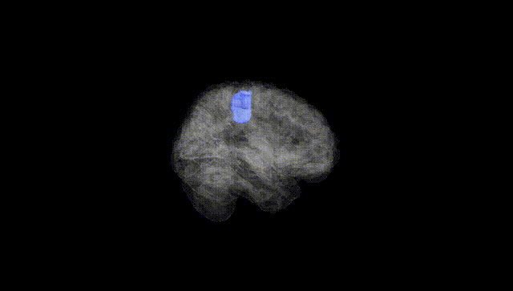
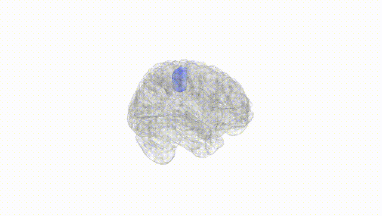
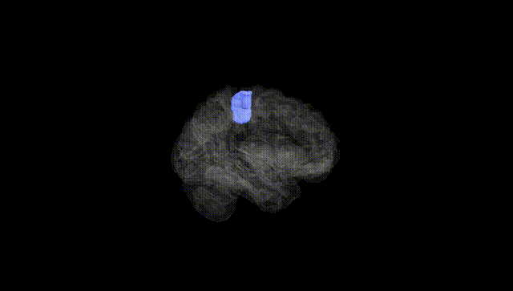
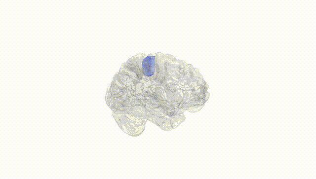
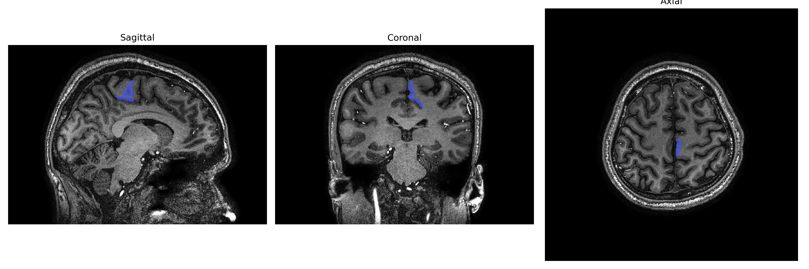
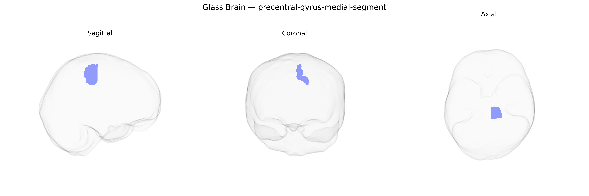

# precentral-gyrus-medial-segment

## Overview

The left precentral gyrus medial segment is the medial portion of the primary motor cortex located on the anterior bank of the central sulcus in the left cerebral hemisphere, extending toward the interhemispheric fissure and abutting supplementary motor areas on the medial surface. In the brainCOLOR Atlas, this region is defined anatomically by its gyral boundaries and functionally by its role in voluntary motor control, particularly of body parts represented medially in the motor homunculus, such as the lower limb and trunk. Neurons in this segment give rise to corticospinal and corticobulbar projections that descend through the internal capsule to influence spinal and brainstem motor circuits, contributing to the planning, initiation, and execution of contralateral movements. Cytoarchitectonically, it corresponds largely to Brodmann area 4 in its medial extent, characterized by a prominent layer V with large pyramidal (Betz) cells that are key for fast, precise motor output.  

There is no direct Wikipedia link for “Left precentral-gyrus-medial-segment.” A closely related and encompassing structure is the precentral gyrus (primary motor cortex):  
https://en.wikipedia.org/wiki/Precentral_gyrus

*Overview generated by GPT-4o (2026).*

---

**Region ID:** 69  
**Hemisphere:** Left  
**Atlas:** brainCOLOR 

---

## precentral-gyrus-medial-segment – Black Background (Full Brain)

**Full Quality Version:** [Download MP4](full_black.mp4)

---

## precentral-gyrus-medial-segment – White Background (Full Brain)

**Full Quality Version:** [Download MP4](full_white.mp4)

---

## precentral-gyrus-medial-segment – Black Background (Hemisphere)

**Full Quality Version:** [Download MP4](hemi_black.mp4)

---

## precentral-gyrus-medial-segment – White Background (Hemisphere)

**Full Quality Version:** [Download MP4](hemi_white.mp4)

---

## Triplanar View – T1 Background

---

## Triplanar View – Ghost Brain


