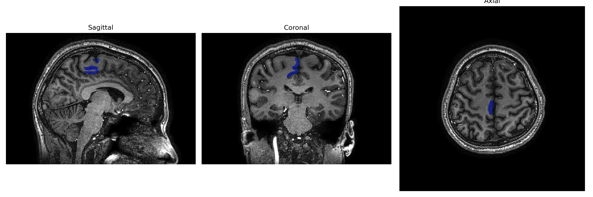
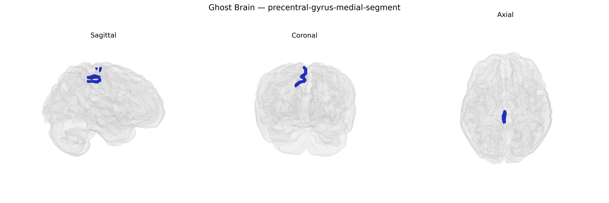

# precentral-gyrus-medial-segment
 
## Overview
 
The right precentral gyrus medial segment is the medial portion of the primary motor cortex located on the superior aspect of the precentral gyrus, bordering the interhemispheric fissure. It corresponds largely to motor representations of the lower limb and trunk within the somatotopic “motor homunculus,” and contributes to the planning and execution of voluntary movements, particularly those requiring postural control and coordination of leg and foot musculature. This region receives extensive input from premotor, supplementary motor, and somatosensory areas and sends descending corticospinal and corticobulbar projections to brainstem and spinal cord motor nuclei, thereby influencing both fine and gross motor control. It is supplied primarily by branches of the anterior cerebral artery and is structurally and functionally interconnected with medial frontal and parietal regions involved in motor planning and sensorimotor integration. There is no direct Wikipedia article for this exact segment; see the related region [Precentral gyrus](https://en.wikipedia.org/wiki/Precentral_gyrus).
 
The right precentral gyrus medial segment, corresponding largely to the medial primary motor cortex/supplementary motor area in the brainCOLOR atlas, has been implicated in several imaging‑genetics and GWAS findings, though most associations are indirect via broader cortical or motor networks. Large-scale cortical morphology GWAS (e.g., ENIGMA and UK Biobank–based studies) have linked common variants in genes involved in neurodevelopment, cytoskeletal organization, and synaptic function (such as HMGA2, KIAA0586, and genes near MAPT and WNT signaling loci) to individual differences in precentral/motor cortical surface area, thickness, and volume, sometimes with lateralized effects that include the right medial precentral region. Polygenic risk scores for neuropsychiatric disorders—especially schizophrenia, bipolar disorder, ADHD, and autism spectrum disorder—show associations with altered structure or function in medial motor and premotor areas, including the right precentral gyrus, consistent with motor planning, timing, and response-inhibition abnormalities in these conditions. GWAS of motor and coordination traits (e.g., reaction time, gait parameters) and of handedness have also implicated loci affecting motor network development and connectivity, with imaging follow‑ups demonstrating genotype-dependent variation in activation or morphology within medial precentral regions. Additionally, genes associated with neurodegenerative disease risk (e.g., ALS and Parkinson’s disease loci) show convergent effects on motor system integrity, and imaging-genetic work has reported structural and functional vulnerability of medial precentral motor areas in carriers of high-risk variants, though these are usually analyzed as part of larger motor or frontoparietal networks rather than as an isolated right medial precentral parcel.
 
*Overview generated by GPT-4o (2026).*
 
---
 
**Region ID:** 68  
**Hemisphere:** Right  
**Atlas:** brainCOLOR 
 
---
 
## precentral-gyrus-medial-segment – Black Background (Full Brain)
 

 
**Full Quality Version:** <a href="full_black.mp4" download>Download MP4</a>
 
---
 
## precentral-gyrus-medial-segment – White Background (Full Brain)
 

 
**Full Quality Version:** <a href="full_white.mp4" download>Download MP4</a>
 
---

## precentral-gyrus-medial-segment – Black Background (Hemisphere)
 

 
**Full Quality Version:** <a href="hemi_black.mp4" download>Download MP4</a>
 
---
 
## precentral-gyrus-medial-segment – White Background (Hemisphere)
 

 
**Full Quality Version:** <a href="hemi_white.mp4" download>Download MP4</a>
 
---

## Triplanar View – T1 Background
 

 
---
 
## Triplanar View – Ghost Brain
 


