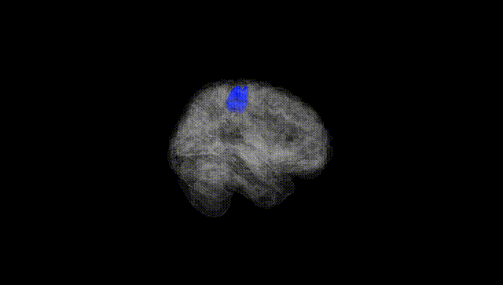
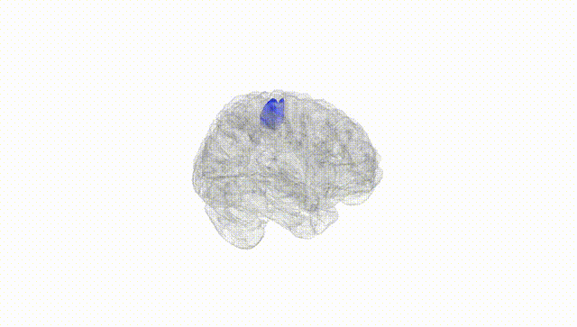
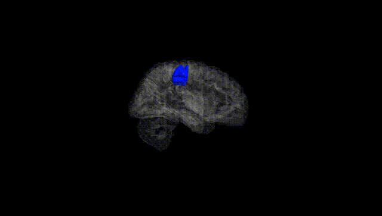
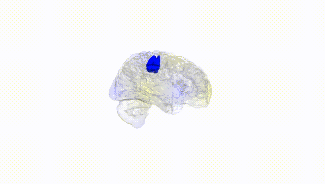
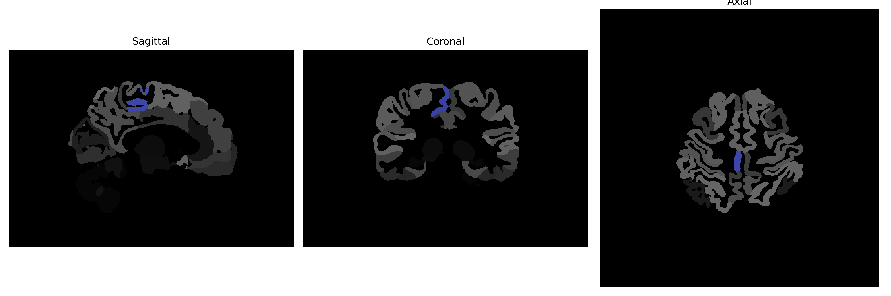

# precentral-gyrus-medial-segment

## Overview

The Right Precentral Gyrus Medial Segment is a region located in the frontal lobe of the brain, specifically within the precentral gyrus, which is known for its role in motor control. This segment is situated medially within the right hemisphere and is involved in the initiation and execution of voluntary movements. The precentral gyrus houses the primary motor cortex, making it a critical area for planning and executing precise movements. Its medial positioning suggests involvement in more specialized motor tasks that may require integration with neighboring structures such as the supplementary motor area for planning complex, coordinated movements.

There is no direct Wikipedia link specifically for the Right Precentral Gyrus Medial Segment. However, a related area for further information is the [Precentral Gyrus](https://en.wikipedia.org/wiki/Precentral_gyrus).

*Overview generated by GPT-4o (2026).*

---

**Region ID:** 68  
**Hemisphere:** Right  
**Atlas:** brainCOLOR 

---

## Full Brain – Black Background

**Full Quality Version:** [Download MP4](full_black.mp4)

---

## Full Brain – White Background

**Full Quality Version:** [Download MP4](full_white.mp4)

---

## Hemisphere Only – Black Background

**Full Quality Version:** [Download MP4](hemi_black.mp4)

---

## Hemisphere Only – White Background

**Full Quality Version:** [Download MP4](hemi_white.mp4)

---

## Triplanar View (Centered on ROI)

