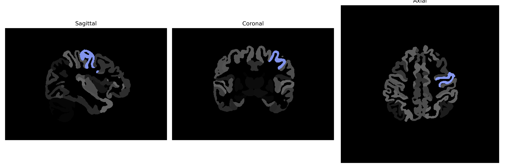

# precentral-gyrus

## Overview

The left precentral gyrus is a prominent structure of the frontal lobe of the human brain, situated anterior to the central sulcus. It is primarily considered the primary motor cortex, denoted as Brodmann area 4, responsible for voluntary motor control. Neurons within this region are organized somatotopically, meaning specific segments of the gyrus correspond to movements of different body parts, often illustrated using a "motor homunculus" stretched along its length. The left precentral gyrus, thus, plays a vital role in executing precise and coordinated voluntary muscle movements on the body's right side due to contralateral control.

There is no direct Wikipedia link for the left precentral gyrus from the brainCOLOR Atlas. However, a related link to its anatomical structure can be found here: [Precentral gyrus on Wikipedia](https://en.wikipedia.org/wiki/Precentral_gyrus).

*Overview generated by GPT-4o (2026).*

---

**Region ID:** 99  
**Hemisphere:** Left  
**Atlas:** brainCOLOR 

---

## Full Brain – Black Background

**Full Quality Version:** [Download MP4](full_black.mp4)

---

## Full Brain – White Background

**Full Quality Version:** [Download MP4](full_white.mp4)

---

## Hemisphere Only – Black Background

**Full Quality Version:** [Download MP4](hemi_black.mp4)

---

## Hemisphere Only – White Background

**Full Quality Version:** [Download MP4](hemi_white.mp4)

---

## Triplanar View (Centered on ROI)

