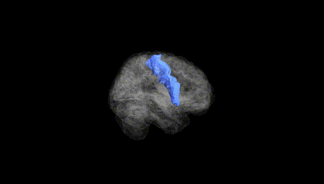
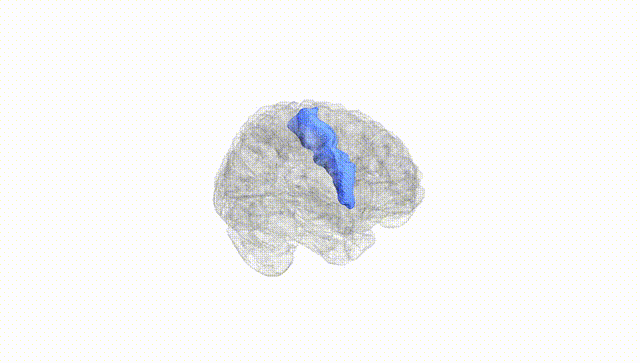
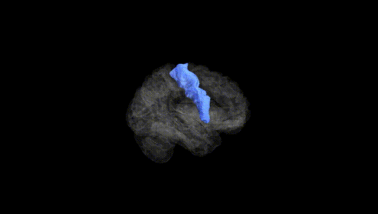
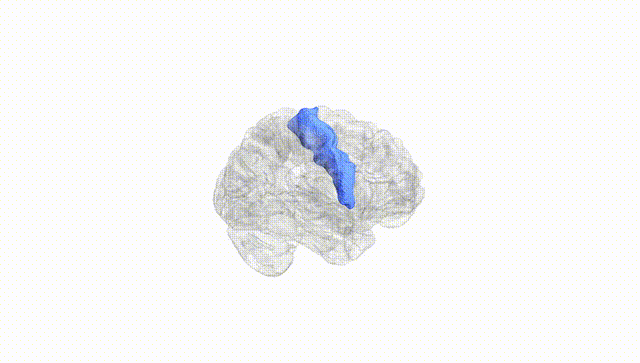
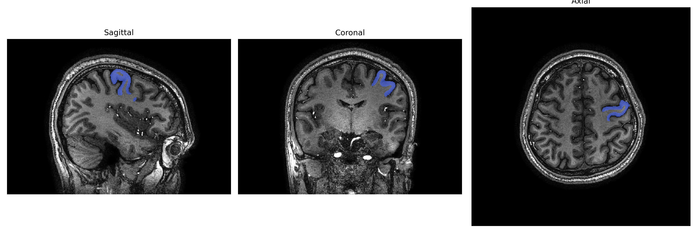
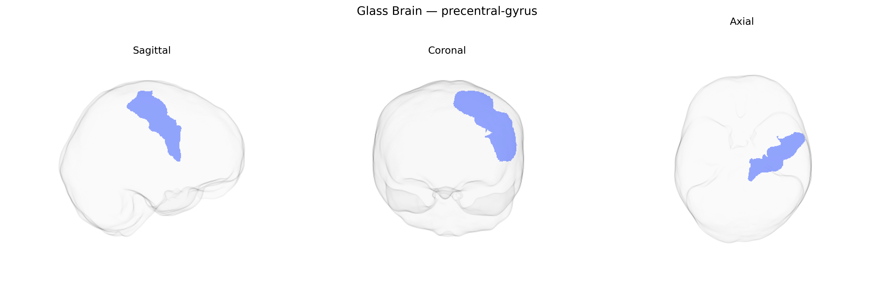

# precentral-gyrus

## Overview

The left precentral gyrus is a cortical region of the frontal lobe located immediately anterior to the central sulcus and is the principal anatomical substrate of the primary motor cortex (Brodmann area 4). It contains a somatotopically organized representation of the contralateral body (motor homunculus), with lower limb areas situated medially and face and hand areas laterally, and it plays a key role in the initiation, execution, and fine control of voluntary movements. Neurons in this region give rise to a major portion of the corticospinal and corticobulbar tracts, providing direct and indirect projections to spinal and brainstem motor circuits. The left precentral gyrus is especially important for skilled motor actions, including those related to speech and complex hand movements, and it is tightly interconnected with premotor, supplementary motor, somatosensory, basal ganglia, and cerebellar regions that modulate motor planning and performance. There is no direct Wikipedia page for the “Left precentral gyrus” as a lateralized structure; a related and encompassing article is: https://en.wikipedia.org/wiki/Precentral_gyrus.

*Overview generated by GPT-4o (2026).*

---

**Region ID:** 99  
**Hemisphere:** Left  
**Atlas:** brainCOLOR 

---

## precentral-gyrus – Black Background (Full Brain)

**Full Quality Version:** [Download MP4](full_black.mp4)

---

## precentral-gyrus – White Background (Full Brain)

**Full Quality Version:** [Download MP4](full_white.mp4)

---

## precentral-gyrus – Black Background (Hemisphere)

**Full Quality Version:** [Download MP4](hemi_black.mp4)

---

## precentral-gyrus – White Background (Hemisphere)

**Full Quality Version:** [Download MP4](hemi_white.mp4)

---

## Triplanar View – T1 Background

---

## Triplanar View – Ghost Brain


