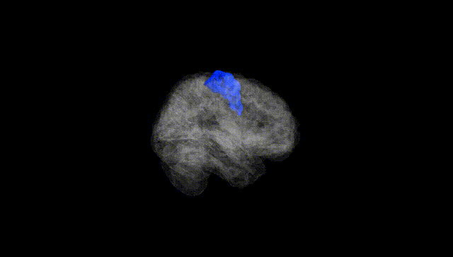
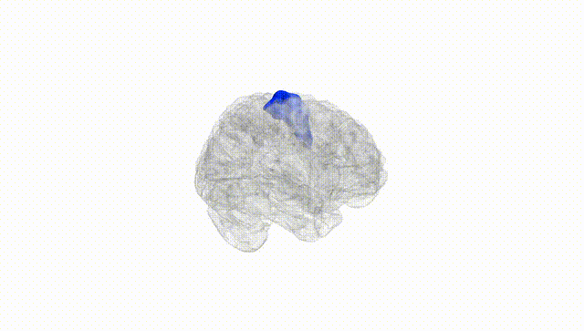
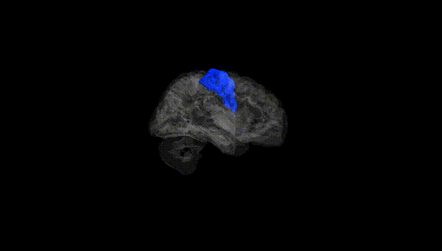
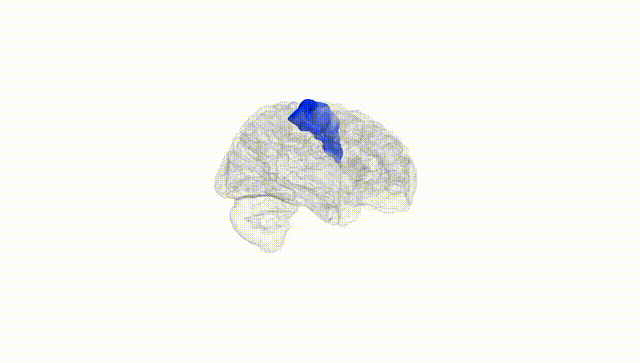
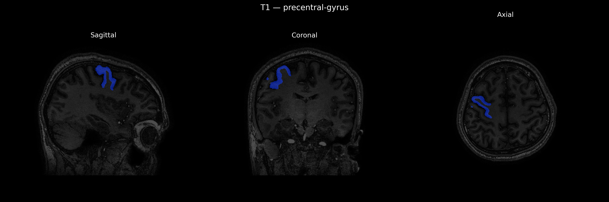
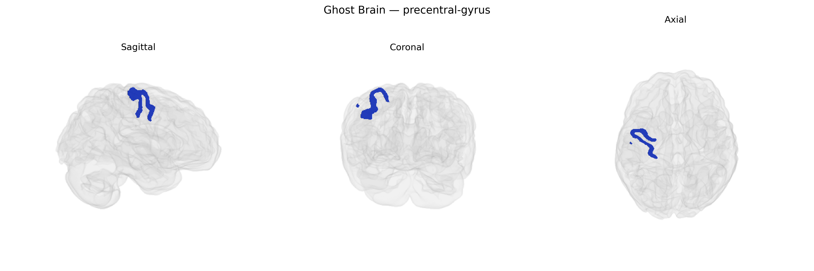

# precentral-gyrus

## Overview

The right precentral gyrus is a cortical region of the frontal lobe located immediately anterior to the central sulcus and posterior to the superior and middle frontal gyri, forming the primary motor cortex (Brodmann area 4) on the right hemisphere. It contains a somatotopically organized representation of the contralateral body, with neurons arranged in a motor homunculus that controls voluntary movements of the left side of the body, from lower limb medially to face and tongue laterally. Cytoarchitectonically, it is characterized by a prominent agranular cortex with large pyramidal neurons (including Betz cells) in layer V that give rise primarily to corticospinal and corticobulbar projections, as well as corticocortical connections with premotor, supplementary motor, parietal, and subcortical motor-related structures. Functionally, the right precentral gyrus contributes not only to the execution of fine motor control but also to aspects of motor planning, coordination, and integration of sensory information for movement, and may show hemispheric specializations, such as roles in spatial aspects of motor behavior and bimanual coordination.  

There is no direct Wikipedia page specifically for the “Right precentral gyrus” as a separate entity; a closely related and encompassing article is: https://en.wikipedia.org/wiki/Precentral_gyrus

*Overview generated by GPT-4o (2026).*

---

**Region ID:** 98  
**Hemisphere:** Right  
**Atlas:** brainCOLOR 

---

## Full Brain – Black Background

**Full Quality Version:** [Download MP4](full_black.mp4)

---

## Full Brain – White Background

**Full Quality Version:** [Download MP4](full_white.mp4)

---

## Hemisphere Only – Black Background

**Full Quality Version:** [Download MP4](hemi_black.mp4)

---

## Hemisphere Only – White Background

**Full Quality Version:** [Download MP4](hemi_white.mp4)

---

## Triplanar View – T1 Background

---

## Triplanar View – Ghost Brain


