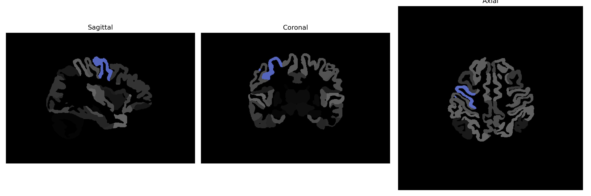

# precentral-gyrus

## Overview

The right precentral gyrus is a prominent structure located in the frontal lobe of the brain. It is a critical part of the motor cortex, primarily involved in the planning, control, and execution of voluntary motor functions. This gyrus is responsible for the contralateral side of the body, meaning it controls the motor activity of the left side. Anatomically, the precentral gyrus is situated anterior to the central sulcus and extends along the lateral aspect of the cerebral hemisphere. The organization of the right precentral gyrus is somatotopic, meaning there is a specific and organized representation of different body parts within it, commonly referred to as the motor homunculus, which is crucial for motor control.

There is no direct Wikipedia link for the right precentral gyrus description from the brainCOLOR Atlas. However, a related Wikipedia page can be accessed here: [Precentral gyrus](https://en.wikipedia.org/wiki/Precentral_gyrus).

*Overview generated by GPT-4o (2026).*

---

**Region ID:** 98  
**Hemisphere:** Right  
**Atlas:** brainCOLOR 

---

## Full Brain – Black Background

**Full Quality Version:** [Download MP4](full_black.mp4)

---

## Full Brain – White Background

**Full Quality Version:** [Download MP4](full_white.mp4)

---

## Hemisphere Only – Black Background

**Full Quality Version:** [Download MP4](hemi_black.mp4)

---

## Hemisphere Only – White Background

**Full Quality Version:** [Download MP4](hemi_white.mp4)

---

## Triplanar View (Centered on ROI)

