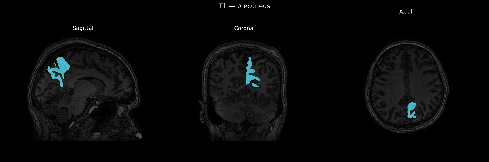
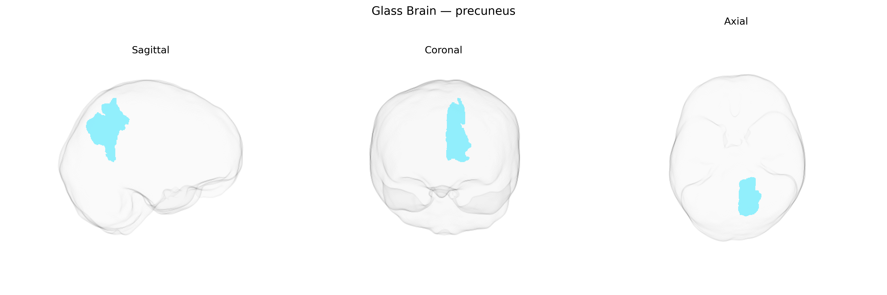

# precuneus
 
## Overview
 
The left precuneus is a medial parietal lobe region situated on the medial surface of the hemisphere, between the marginal branch of the cingulate sulcus and the parieto-occipital sulcus, and superior to the posterior cingulate cortex. It is heavily interconnected with parietal association cortex, medial prefrontal regions, and posterior cingulate areas, and is a core node of the default mode network, contributing to visuospatial imagery, self-referential processing, episodic memory retrieval, and aspects of consciousness and internal mentation. Structurally, it is supplied primarily by branches of the posterior cerebral artery and exhibits high resting metabolic activity relative to many other cortical regions. There is no direct Wikipedia article specifically for the “left precuneus” as a separate entry; however, it is part of the [Precuneus](https://en.wikipedia.org/wiki/Precuneus).
 
The left precuneus, as defined in the brainCOLOR Atlas, has been implicated in multiple GWAS and imaging‑genetics studies through associations between its structure or function and common genetic variants linked to neuropsychiatric and cognitive traits. Variants in genes involved in synaptic plasticity, neurodevelopment, and myelination (such as BDNF, APOE, and genes in glutamatergic and GABAergic pathways) have been associated with precuneus cortical thickness, surface area, or resting‑state connectivity in large consortia like ENIGMA and UK Biobank. Polygenic risk scores for Alzheimer’s disease, schizophrenia, major depressive disorder, and autism spectrum disorder show associations with altered precuneus morphology or activity, consistent with this region’s role in default mode network functioning, self-referential processing, and episodic memory. GWAS of cognitive performance, intelligence, and educational attainment report that alleles conferring higher cognitive ability are related to structural and functional differences in medial parietal regions including the left precuneus. Additionally, imaging‑genetics work in disorders such as Alzheimer’s disease and schizophrenia indicates that risk variants (for example in APOE and complement pathway genes) modulate atrophy or connectivity patterns encompassing the left precuneus, further supporting a genetically mediated contribution of this region to vulnerability for cognitive decline and psychiatric illness.
 
*Overview generated by GPT-4o (2026).*
 
---
 
**Region ID:** 85  
**Hemisphere:** Left  
**Atlas:** brainCOLOR 
 
---
 
## precuneus – Black Background (Full Brain)
 

 
**Full Quality Version:** <a href="full_black.mp4" download>Download MP4</a>
 
---
 
## precuneus – White Background (Full Brain)
 

 
**Full Quality Version:** <a href="full_white.mp4" download>Download MP4</a>
 
---

## precuneus – Black Background (Hemisphere)
 

 
**Full Quality Version:** <a href="hemi_black.mp4" download>Download MP4</a>
 
---
 
## precuneus – White Background (Hemisphere)
 

 
**Full Quality Version:** <a href="hemi_white.mp4" download>Download MP4</a>
 
---

## Triplanar View – T1 Background
 

 
---
 
## Triplanar View – Ghost Brain
 


