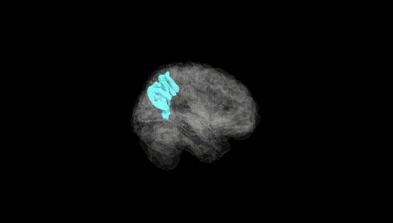
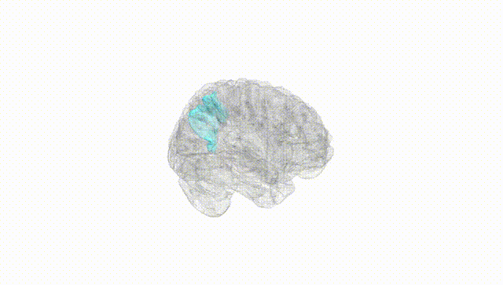
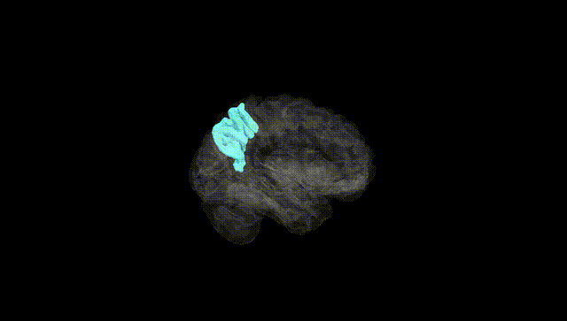
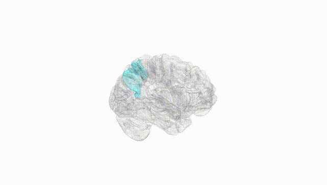
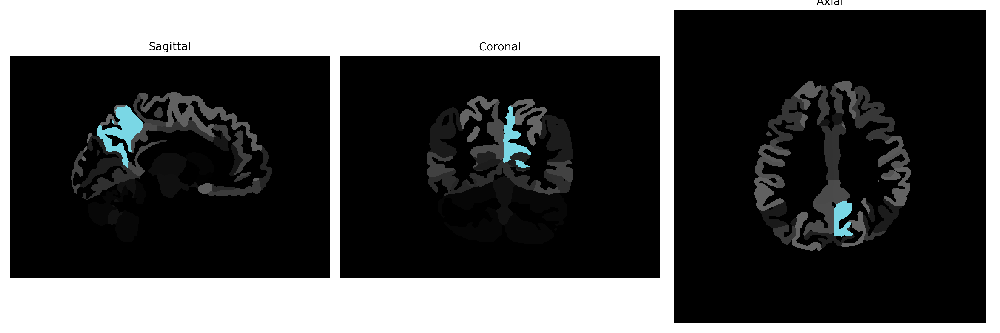

# precuneus

## Overview

The Left precuneus is a subregion located in the superior parietal lobule of the parietal lobe, posterior to the paracentral lobule and anterior to the occipital cortex. It is bordered medially by the longitudinal fissure and laterally by the superior parietal gyrus. This region is involved in a variety of complex functions including visuo-spatial imagery, episodic memory retrieval, self-processing operations, and aspects of consciousness. The precuneus has extensive functional connectivity with other brain areas, being part of the default mode network, which is active during rest and mind-wandering.

There is no direct Wikipedia link for a brainCOLOR Atlas description of the Left precuneus. However, a related link to a general description of the precuneus in the brain can be found here: [Precuneus on Wikipedia](https://en.wikipedia.org/wiki/Precuneus).

*Overview generated by GPT-4o (2026).*

---

**Region ID:** 85  
**Hemisphere:** Left  
**Atlas:** brainCOLOR 

---

## Full Brain – Black Background

**Full Quality Version:** [Download MP4](full_black.mp4)

---

## Full Brain – White Background

**Full Quality Version:** [Download MP4](full_white.mp4)

---

## Hemisphere Only – Black Background

**Full Quality Version:** [Download MP4](hemi_black.mp4)

---

## Hemisphere Only – White Background

**Full Quality Version:** [Download MP4](hemi_white.mp4)

---

## Triplanar View (Centered on ROI)

