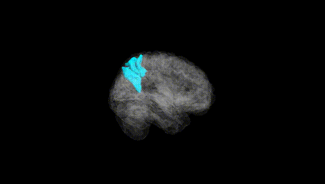
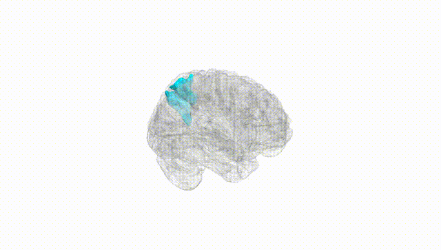
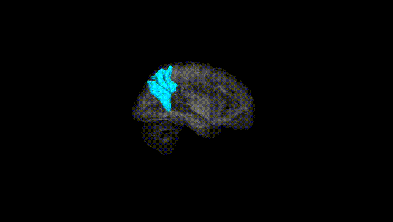
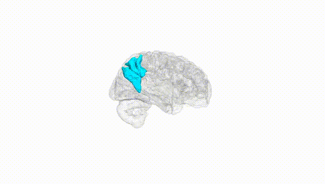
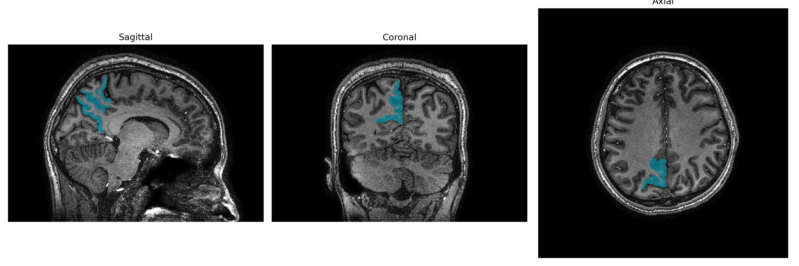
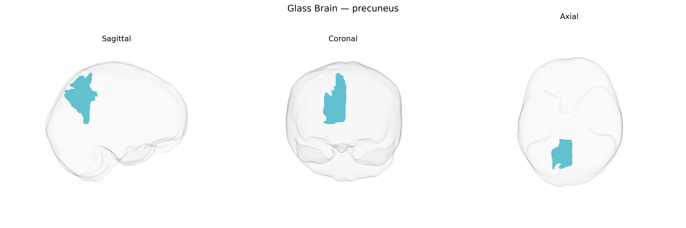

# precuneus

## Overview

The right precuneus is a medial parietal lobe region located on the medial surface of the cerebral hemisphere, bounded anteriorly by the marginal branch of the cingulate sulcus, posteriorly by the parieto-occipital sulcus, and inferiorly by the subparietal sulcus. It forms part of the superior parietal lobule and is heavily interconnected with frontal, parietal, occipital, and limbic regions. Functionally, the right precuneus is implicated in visuospatial processing, self-referential cognition, aspects of consciousness, mental imagery, episodic memory retrieval, and is a core hub of the default mode network. It shows high metabolic activity at rest and is often activated in tasks involving perspective taking, navigation, and internal mentation.  

Wikipedia URL (related structure; no direct page for “Right precuneus” specifically):  
https://en.wikipedia.org/wiki/Precuneus

*Overview generated by GPT-4o (2026).*

---

**Region ID:** 84  
**Hemisphere:** Right  
**Atlas:** brainCOLOR 

---

## precuneus – Black Background (Full Brain)

**Full Quality Version:** [Download MP4](full_black.mp4)

---

## precuneus – White Background (Full Brain)

**Full Quality Version:** [Download MP4](full_white.mp4)

---

## precuneus – Black Background (Hemisphere)

**Full Quality Version:** [Download MP4](hemi_black.mp4)

---

## precuneus – White Background (Hemisphere)

**Full Quality Version:** [Download MP4](hemi_white.mp4)

---

## Triplanar View – T1 Background

---

## Triplanar View – Ghost Brain


