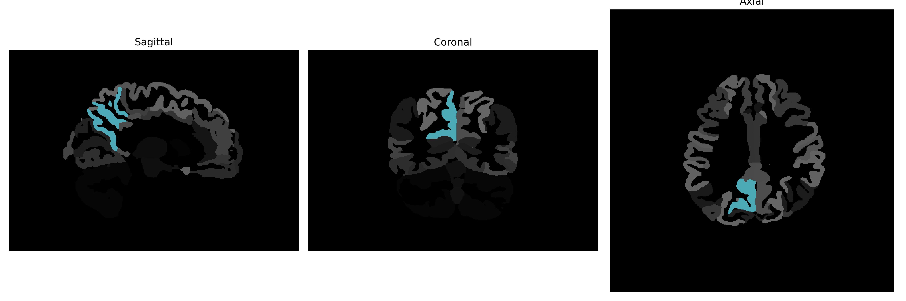

# precuneus

## Overview

The right precuneus is located in the superior medial region of the parietal lobe and plays a critical role in integrating and processing information from various cognitive and sensorimotor processes. It is involved in a wide array of complex functions such as visuo-spatial imagery, episodic memory retrieval, self-referential processing, attention, and aspects of consciousness. The precuneus, together with adjacent regions, contributes to the default mode network, which is active during rest and self-reflective thought. Anatomically, it lies anterior to the cuneus and is bordered by the paracentral lobule anteriorly and the occipital lobe posteriorly.

There is no direct Wikipedia link for the right precuneus brain region from the brainCOLOR Atlas. However, a related link to the precuneus can be found at: https://en.wikipedia.org/wiki/Precuneus

*Overview generated by GPT-4o (2026).*

---

**Region ID:** 84  
**Hemisphere:** Right  
**Atlas:** brainCOLOR 

---

## Full Brain – Black Background

**Full Quality Version:** [Download MP4](full_black.mp4)

---

## Full Brain – White Background

**Full Quality Version:** [Download MP4](full_white.mp4)

---

## Hemisphere Only – Black Background

**Full Quality Version:** [Download MP4](hemi_black.mp4)

---

## Hemisphere Only – White Background

**Full Quality Version:** [Download MP4](hemi_white.mp4)

---

## Triplanar View (Centered on ROI)

