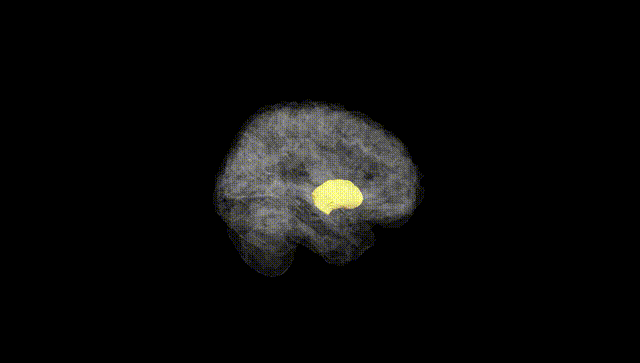
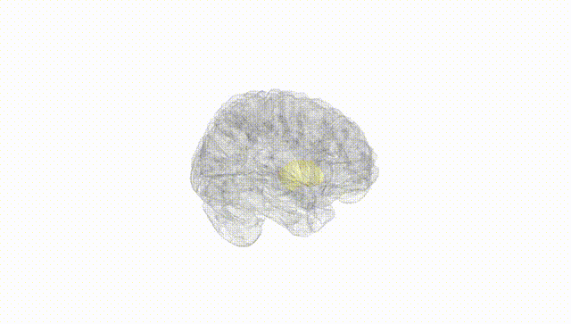
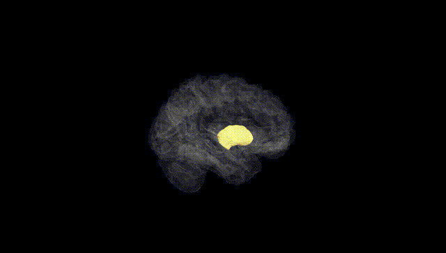
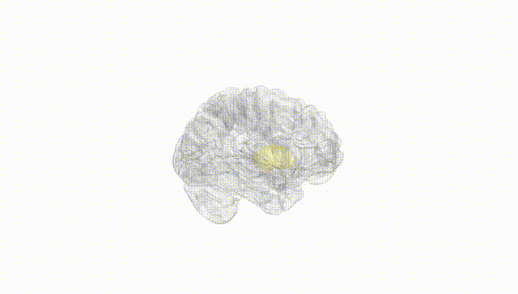
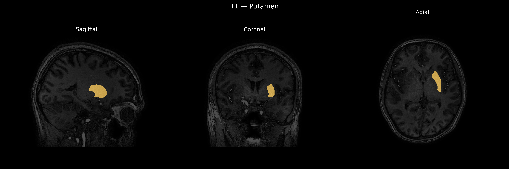
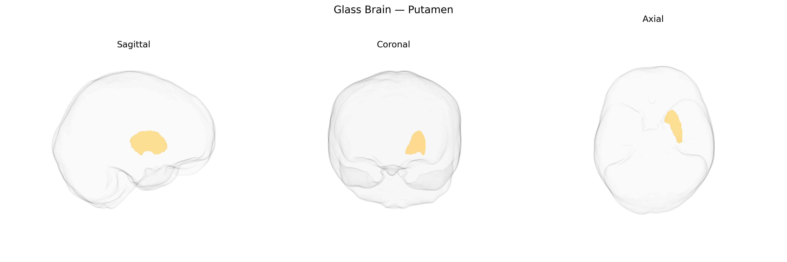

# Putamen
 
## Overview
 
The Left Putamen is the left-sided component of the putamen, a large, rounded nucleus in the basal ganglia that plays a central role in motor control, habit formation, and aspects of reward and learning. Composed predominantly of medium spiny GABAergic neurons, it receives dense excitatory glutamatergic inputs from the cerebral cortex (especially motor and premotor areas) and thalamus, as well as dopaminergic modulation from the substantia nigra pars compacta. The Left Putamen participates in cortico–striato–pallido–thalamo–cortical loops, influencing the planning, initiation, and execution of voluntary movements and contributing to procedural memory and action selection. Structural or functional abnormalities in this region are implicated in movement disorders such as Parkinson’s disease, Huntington’s disease, and dystonia, as well as in certain neuropsychiatric conditions involving altered reward processing. [Putamen](https://en.wikipedia.org/wiki/Putamen)
 
The left putamen, as defined in the brainCOLOR Atlas, has been implicated in multiple genetic association studies, particularly large-scale neuroimaging GWAS that link common variants to striatal volume and morphology. Variants in and near genes such as DRD2, PPP1R1B (DARPP-32), FOXP2, KTN1, and MAN2A1, among others, have been associated with putamen volume, with some effects showing lateralization to the left hemisphere. Polygenic architectures related to dopaminergic signaling, synaptic plasticity, and neurodevelopmental pathways appear to influence left putamen structure, consistent with its role in motor control, habit learning, and reward processing. GWAS of neuropsychiatric and neurological disorders—especially schizophrenia, bipolar disorder, major depressive disorder, attention-deficit/hyperactivity disorder, obsessive–compulsive disorder, Parkinson’s disease, and substance use disorders—have reported overlapping genetic loci that are also associated with variation in putamen volume or function, suggesting shared biological underpinnings. Additionally, genetic correlations have been observed between left putamen structure and cognitive traits such as intelligence, psychomotor speed, and educational attainment, as well as behavioral phenotypes like risk-taking and impulsivity, indicating that common genetic variants contribute to interindividual differences in both the anatomy of the left putamen and a broad spectrum of brain-related traits and disorders.
 
*Overview generated by GPT-4o (2026).*
 
---
 
**Region ID:** 14  
**Hemisphere:** Left  
**Atlas:** brainCOLOR 
 
---
 
## Putamen – Black Background (Full Brain)
 

 
**Full Quality Version:** <a href="full_black.mp4" download>Download MP4</a>
 
---
 
## Putamen – White Background (Full Brain)
 

 
**Full Quality Version:** <a href="full_white.mp4" download>Download MP4</a>
 
---

## Putamen – Black Background (Hemisphere)
 

 
**Full Quality Version:** <a href="hemi_black.mp4" download>Download MP4</a>
 
---
 
## Putamen – White Background (Hemisphere)
 

 
**Full Quality Version:** <a href="hemi_white.mp4" download>Download MP4</a>
 
---

## Triplanar View – T1 Background
 

 
---
 
## Triplanar View – Ghost Brain
 


