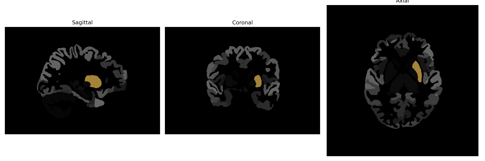

# Putamen

## Overview

The Left Putamen is a round structure located at the base of the forebrain and an integral part of the basal ganglia. It plays a crucial role in a variety of functions including the regulation of movement and various aspects of motor control, and is also involved in learning processes related to movement. The putamen receives input from the motor cortex and helps to control movements by regulating neurotransmitters such as dopamine and glutamate. Anatomically, it is situated lateral to the globus pallidus and is separated from the caudate nucleus by the internal capsule, forming part of the striatum. It is highly interconnected with other regions of the brain, ensuring its pivotal role in both motor and non-motor functions.

There is no direct Wikipedia link for the Left Putamen from the brainCOLOR Atlas. However, a related area to explore is the basal ganglia. Here is the URL to the Wikipedia page for the basal ganglia: [https://en.wikipedia.org/wiki/Basal_ganglia](https://en.wikipedia.org/wiki/Basal_ganglia).

*Overview generated by GPT-4o (2026).*

---

**Region ID:** 14  
**Hemisphere:** Left  
**Atlas:** brainCOLOR 

---

## Full Brain – Black Background

**Full Quality Version:** [Download MP4](full_black.mp4)

---

## Full Brain – White Background

**Full Quality Version:** [Download MP4](full_white.mp4)

---

## Hemisphere Only – Black Background

**Full Quality Version:** [Download MP4](hemi_black.mp4)

---

## Hemisphere Only – White Background

**Full Quality Version:** [Download MP4](hemi_white.mp4)

---

## Triplanar View (Centered on ROI)

