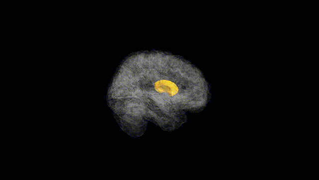
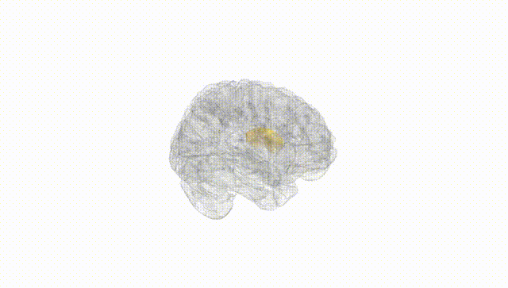
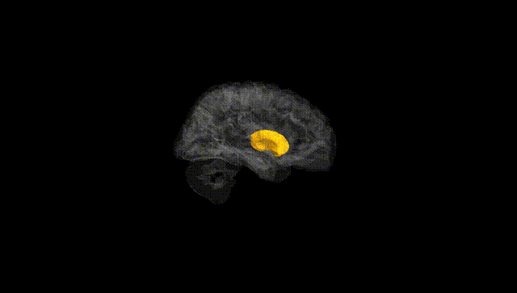
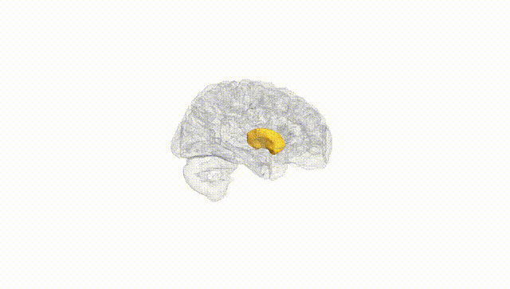
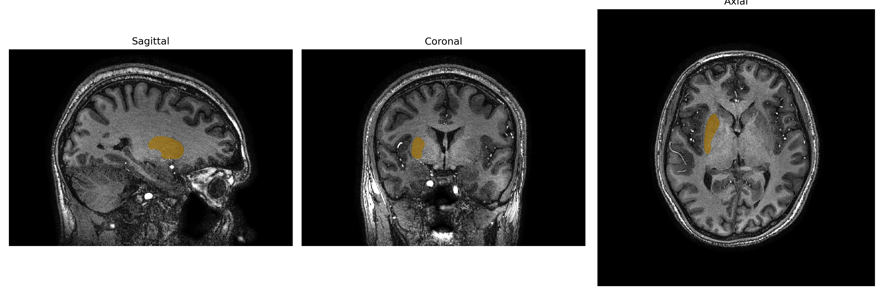
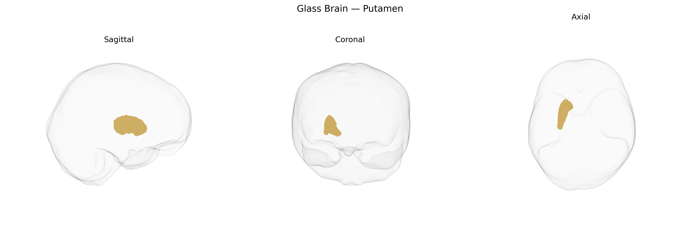

# Putamen

## Overview

The right putamen is the right-sided component of the putamen, a large, rounded, subcortical gray matter structure that, together with the caudate nucleus, forms the dorsal striatum within the basal ganglia. It lies lateral to the internal capsule and medial to the external capsule and claustrum, and is primarily composed of medium spiny GABAergic neurons receiving dense glutamatergic input from widespread cortical regions (notably motor, premotor, and somatosensory cortices) and dopaminergic innervation from the substantia nigra pars compacta. Functionally, the right putamen participates in motor planning and execution, habit formation, procedural learning, and aspects of reward-based and reinforcement learning, with hemispheric lateralization sometimes reported for motor dominance and certain cognitive-motor functions. It is interconnected with the globus pallidus, thalamus, and frontal cortical areas via cortico-striato-pallido-thalamo-cortical loops, and is implicated in movement disorders (e.g., Parkinson’s disease, Huntington’s disease, dystonia) as well as neuropsychiatric conditions involving procedural and habit systems.  

There is no direct Wikipedia page specifically for “Right Putamen”; a closely related and encompassing structure is the putamen:  
https://en.wikipedia.org/wiki/Putamen

*Overview generated by GPT-4o (2026).*

---

**Region ID:** 13  
**Hemisphere:** Right  
**Atlas:** brainCOLOR 

---

## Putamen – Black Background (Full Brain)

**Full Quality Version:** [Download MP4](full_black.mp4)

---

## Putamen – White Background (Full Brain)

**Full Quality Version:** [Download MP4](full_white.mp4)

---

## Putamen – Black Background (Hemisphere)

**Full Quality Version:** [Download MP4](hemi_black.mp4)

---

## Putamen – White Background (Hemisphere)

**Full Quality Version:** [Download MP4](hemi_white.mp4)

---

## Triplanar View – T1 Background

---

## Triplanar View – Ghost Brain


